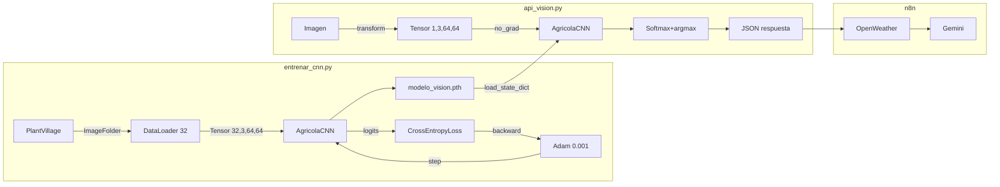

# Guía de Estudio Progresiva — Orquestador Agrícola Neural

> Material organizado de **menos a más técnico**. Estudia en orden y detente donde te sientas cómodo.

---

## Índice

- 🟢 [Nivel 1 — ¿Qué hace este proyecto? (5 min)](#-nivel-1--qué-hace-este-proyecto)
- 🟢🟡 [Nivel 1.5 — El sistema por dentro, sin fórmulas (7 min)](#-nivel-15--el-sistema-por-dentro-sin-fórmulas)
- 🟡 [Nivel 2 — La arquitectura de la red (10 min)](#-nivel-2--la-arquitectura-de-la-red)
- 🟡🟠 [Nivel 2.5 — Capas, parámetros y el flujo de datos (13 min)](#-nivel-25--capas-parámetros-y-el-flujo-de-datos)
- 🟠 [Nivel 3 — Cómo aprende la red (15 min)](#-nivel-3--cómo-aprende-la-red)
- 🟠🔴 [Nivel 3.5 — El ciclo de entrenamiento con términos reales (18 min)](#-nivel-35--el-ciclo-de-entrenamiento-con-términos-reales)
- 🔴 [Nivel 4 — Fundamentos matemáticos y decisiones de diseño (25 min)](#-nivel-4--fundamentos-matemáticos-y-decisiones-de-diseño)
- ⚫ [Nivel 5 — Auditoría completa de hiperparámetros (referencia)](#-nivel-5--auditoría-completa-de-hiperparámetros)
- 📝 [Preguntas de Auto-Evaluación](#-preguntas-de-auto-evaluación)

---

## 🟢 Nivel 1 — ¿Qué hace este proyecto?

**Sin tecnicismos. Solo el problema y la solución.**

Un agricultor tiene una planta enferma. Toma una foto con el celular. El sistema le dice en segundos qué enfermedad tiene y qué tratamiento aplicar, considerando el clima de su zona.

### Los tres pasos del sistema

```
📷 Foto de la hoja
       │
       ▼
🧠 Red Neuronal — analiza la imagen como un experto visual
       │ "Es Oídio, confianza 92%"
       ▼
🌤️ API del Clima — consulta temperatura y humedad
       │
       ▼
🤖 Gemini (IA de Google) — cruza diagnóstico + clima → recomienda tratamiento
       │
       ▼
💬 Respuesta al agricultor (web o Telegram)
```

### Las tres enfermedades detectadas

| Clase | Qué es | Síntoma visual |
|---|---|---|
| `Planta_Sana` | Sin enfermedad | Verde uniforme |
| `Tizon_Tardio_Papa` | Hongo que destruye papas | Manchas marrones oscuras |
| `Oidio_Vid` | Hongo que afecta uvas | Polvo blanco en la hoja |

### Los dos archivos de código

| Archivo | Qué hace en una frase |
|---|---|
| `entrenar_cnn.py` | Enseña a la red a distinguir las 3 enfermedades usando miles de fotos |
| `api_vision.py` | Expone la red entrenada como servicio web que recibe fotos y responde diagnósticos |

---

## 🟢🟡 Nivel 1.5 — El sistema por dentro, sin fórmulas

**Introduces los nombres correctos sin entrar en matemáticas.**

### El modelo: qué es y para qué sirve

El corazón del sistema es un **modelo de Deep Learning** llamado `AgricolaCNN`. Un modelo es un programa que, después de ver miles de ejemplos con respuestas correctas, aprende a clasificar imágenes nuevas que nunca ha visto.

El proceso tiene dos fases separadas:
- **Fase 1 — Entrenamiento** (`entrenar_cnn.py`): el modelo aprende mirando fotos etiquetadas. Al terminar, guarda lo aprendido en un archivo llamado `modelo_vision.pth`.
- **Fase 2 — Inferencia** (`api_vision.py`): el modelo cargado en memoria recibe fotos nuevas y predice la clase. No aprende más, solo aplica lo que ya sabe.

### El dataset: los datos de entrenamiento

El modelo aprendió usando el **dataset PlantVillage**: una colección de ~2000 fotos de hojas reales, ya organizadas en carpetas por enfermedad. Cada carpeta es una clase:

```
data/
  Oidio_Vid/         ← ~1000 fotos de hojas con Oídio
  Planta_Sana/       ← ~152 fotos de hojas sanas
  Tizon_Tardio_Papa/ ← ~1000 fotos de hojas con Tizón
```

> [!NOTE]
> Hay muchas más fotos de Oídio y Tizón que de plantas sanas (152 vs 1000). Esto se llama **desbalance de clases** y es una debilidad conocida del sistema.

### La inferencia: cómo responde en producción

Cuando el agricultor sube una foto, `api_vision.py` sigue estos pasos:
1. Recibe la imagen como archivo binario por HTTP
2. La preprocesa (redimensiona a 64×64, convierte a números)
3. La pasa por el modelo → obtiene 3 scores, uno por enfermedad
4. Selecciona la enfermedad con el score más alto
5. Responde con un JSON: `{"diagnostico": "Oidio_Vid", "confianza": 0.92}`

---

## 🟡 Nivel 2 — La arquitectura de la red

**Cómo está estructurada la red internamente, con analogías.**

### ¿Qué es una Red Neuronal Convolucional (CNN)?

Imagina que analizas una foto con una lupa pequeña que se mueve por toda la imagen:
- **Primera pasada (16 lupas):** detecta cosas simples — bordes, cambios de color, zonas brillantes
- **Segunda pasada (32 lupas):** combina esos patrones simples y detecta cosas complejas — manchas, texturas irregulares
- **Al final:** con toda esa información resume la imagen y decide la clase

La "lupa" se llama **filtro** o **kernel**. La red tiene 2 bloques de filtros seguidos de un **clasificador** final.

### La arquitectura de AgricolaCNN

```
FOTO (64×64 píxeles, 3 canales RGB)
    │
    ▼ BLOQUE CONV 1: 16 filtros buscan patrones simples
    │   La imagen mantiene su tamaño (64×64) pero ahora tiene 16 "versiones"
    │   Luego se achica a la mitad → 32×32  (operación: MaxPooling)
    │
    ▼ BLOQUE CONV 2: 32 filtros buscan patrones complejos
    │   La imagen sigue siendo 32×32 pero ahora tiene 32 "versiones"
    │   Luego se achica a la mitad → 16×16  (operación: MaxPooling)
    │
    ▼ APLANADO (Flatten): convierte la cuadrícula en una lista
    │   32 versiones × 16×16 píxeles = 8192 números en fila
    │
    ▼ CLASIFICADOR (MLP): reduce y decide
    │   8192 números → 64 neuronas → 3 scores finales
    │
    ▼ El score más alto gana → "Oidio_Vid con 92%"
```

### ¿Qué guarda `modelo_vision.pth`?

Guarda todos los **pesos** (valores numéricos) que los filtros y el clasificador aprendieron durante el entrenamiento. Son los ~529,635 números que definen exactamente qué busca cada filtro. Sin este archivo, la red existe como estructura vacía pero no sabe hacer nada.

---

## 🟡🟠 Nivel 2.5 — Capas, parámetros y el flujo de datos

**Los mismos conceptos del nivel 2 pero con los nombres técnicos correctos.**

### Tipos de capas en AgricolaCNN

| Capa (código) | Nombre técnico | Qué hace |
|---|---|---|
| `nn.Conv2d` | Capa Convolucional | Aplica filtros deslizantes, extrae features |
| `nn.ReLU` | Función de Activación | Introduce no-linealidad: `f(x) = max(0, x)` |
| `nn.MaxPool2d` | Capa de Pooling | Reduce dimensiones espaciales, guarda el máximo |
| `nn.Linear` | Capa Densa / Fully Connected | Multiplica todos los inputs con todos los pesos |

### Qué son los parámetros (pesos)

Cada filtro convolucional y cada neurona densa tiene **pesos**: valores numéricos que se ajustan durante el entrenamiento. El modelo los aprende solos; nadie los define a mano.

Conteo por capa:
- `conv1`: 448 pesos  
- `conv2`: 4,640 pesos  
- `fc1`: 524,352 pesos ← aquí está el 99% del modelo  
- `fc2`: 195 pesos  
- **Total: 529,635 pesos**

### El flujo de datos como transformación

Cada capa transforma los datos. La forma de los datos se llama **shape** y se escribe como `[dimensiones]`:

```
Imagen original      → PIL [alto, ancho, 3_colores]
Después de Resize    → PIL [64, 64, 3]
Después de ToTensor  → Tensor [3, 64, 64]    ← formato PyTorch: [canales, alto, ancho]
En el batch          → Tensor [32, 3, 64, 64] ← 32 imágenes a la vez
Después de conv1     → Tensor [32, 16, 64, 64] ← 16 feature maps
Después de pool1     → Tensor [32, 16, 32, 32] ← se achicó espacialmente
Después de conv2     → Tensor [32, 32, 32, 32] ← 32 feature maps
Después de pool2     → Tensor [32, 32, 16, 16] ← se achicó de nuevo
Después de Flatten   → Tensor [32, 8192]        ← todo aplanado
Después de fc1       → Tensor [32, 64]
Después de fc2       → Tensor [32, 3]           ← 3 scores por imagen
```

### ¿Por qué se usan mini-batches?

En vez de procesar una foto a la vez, el **DataLoader** agrupa 32 fotos en un **batch** (lote) y las procesa en paralelo. Ventajas:
- Más rápido (operaciones matriciales paralelas)
- Los gradientes se promedian → menos ruidosos → mejor aprendizaje
- Uso eficiente de memoria

---

## 🟠 Nivel 3 — Cómo aprende la red

**El ciclo de entrenamiento con analogías.**

### La analogía del estudiante con examen

1. **La red ve una foto** → predice una clase (al azar al principio)
2. **Se compara con la respuesta correcta** → se calcula el error llamado **loss**
3. **Se analiza dónde se equivocó** → **backpropagation** encuentra qué pesos fallaron
4. **Se corrigen los pesos** → el **optimizador** los ajusta un poco
5. **Repetir 630 veces** → la red mejora progresivamente

### Épocas y batches

- **Época:** una pasada completa por las ~2000 fotos del dataset
- **Batch:** grupo de 32 fotos procesadas juntas antes de actualizar los pesos
- Cálculo: 2000 fotos ÷ 32 por batch = ~63 batches por época × 10 épocas = **~630 actualizaciones totales**

```
ÉPOCA 1:
  Batch 1 (32 fotos) → loss=2.1 → ajustar pesos
  Batch 2 (32 fotos) → loss=1.9 → ajustar pesos
  ...63 batches...
  Loss promedio: 1.8

ÉPOCA 5:  Loss promedio: 0.8
ÉPOCA 10: Loss promedio: 0.3  ← la red ya aprendió
```

### La función de pérdida (loss)

Es el "puntaje de equivocación". Si la red dice "Planta_Sana" cuando era Tizón, el loss es alto. Si acierta con alta confianza, el loss es casi 0.

| Situación | Loss |
|---|---|
| Muy seguro y correcto (95%) | ~0.05 |
| Inseguro (50%) | ~0.69 |
| Muy seguro pero equivocado (5%) | ~3.0 |

### Inferencia: sin aprendizaje

En producción (`api_vision.py`) **no hay entrenamiento**. La red solo hace el paso hacia adelante una vez y devuelve el resultado. Es mucho más rápido porque no necesita calcular los gradientes.

---

## 🟠🔴 Nivel 3.5 — El ciclo de entrenamiento con términos reales

**Los mismos pasos del nivel 3 con los nombres y conceptos técnicos.**

### Los 5 pasos de cada iteración (en código)

```python
optimizer.zero_grad()          # 1. Limpiar gradientes del batch anterior
outputs = model(inputs)        # 2. Forward pass: calcular predicciones
loss = criterion(outputs, labels)  # 3. Calcular la pérdida (CrossEntropyLoss)
loss.backward()                # 4. Backpropagation: calcular gradientes
optimizer.step()               # 5. Actualizar los 529,635 pesos (Adam)
```

### ¿Qué es un gradiente?

Es la dirección y magnitud en que hay que mover cada peso para que el loss baje. Se calcula aplicando la **regla de la cadena** desde la capa de salida hacia la de entrada (de ahí "retro-propagación").

- Si el gradiente de un peso es positivo → el peso debe bajar
- Si es negativo → el peso debe subir
- Si es ~0 → ese peso ya está bien o no está aprendiendo

### CrossEntropyLoss: la función de pérdida

Combina dos operaciones: **LogSoftmax** (convierte scores en log-probabilidades) + **NLLLoss** (penaliza).

Fórmula: `L = -log(P(clase_correcta))`

Ejemplo: si la red asigna 5% de probabilidad a "Tizón" cuando la foto es Tizón:
`L = -log(0.05) = 3.0` → loss alto → el optimizador ajustará mucho los pesos

### El optimizador Adam

**Adam** (Adaptive Moment Estimation) ajusta el learning rate por parámetro. Tiene memoria de cómo se han comportado los gradientes:
- `β₁ = 0.9`: momentum — usa el historial reciente de gradientes
- `β₂ = 0.999`: escala — estabiliza pesos con gradientes muy variables
- `lr = 0.001`: paso base — cuánto moverse en cada actualización

### model.train() vs model.eval()

| Modo | Cuándo | Efecto |
|---|---|---|
| `model.train()` | Durante entrenamiento | Habilita Dropout y BatchNorm actualiza stats (si la red los usara) |
| `model.eval()` | Durante inferencia | Desactiva Dropout, BatchNorm usa stats globales |

### torch.no_grad()

Durante inferencia no se necesita calcular gradientes (no hay backpropagation). `torch.no_grad()` le dice a PyTorch que no construya el grafo computacional → ~50% menos memoria, forward pass más rápido.

---

## 🔴 Nivel 4 — Fundamentos matemáticos y decisiones de diseño

**El "por qué" detrás de cada decisión técnica.**

### ¿Por qué ReLU y no Sigmoid?

**Vanishing Gradient Problem:** en redes con múltiples capas, los gradientes se multiplican por la derivada de la activación en cada capa hacia atrás.

- `Sigmoid'(x) ≤ 0.25` → después de 3 capas: `0.25³ = 0.016` → gradiente casi nulo → `conv1` no aprende nada
- `ReLU'(x) = 1` para x > 0 → gradiente sin reducción → todas las capas aprenden

### ¿Por qué Adam y no SGD puro?

SGD: `w = w - lr × ∂L/∂w` (mismo lr para todos)

Adam: `w = w - lr × m̂ / (√v̂ + ε)` donde:
- `m̂ = β₁·m + (1-β₁)·g` → promedio móvil del gradiente (momentum)
- `v̂ = β₂·v + (1-β₂)·g²` → promedio móvil del gradiente² (escala adaptativa)

**Resultado:** con solo 630 actualizaciones disponibles, Adam converge donde SGD todavía está calentando.

### ¿Por qué CrossEntropyLoss y no MSE?

MSE es para regresión (valores continuos). Para clasificación, la "respuesta correcta" es una etiqueta discreta (0, 1 o 2). CrossEntropyLoss está diseñada para probabilidades: penaliza exponencialmente cuando el modelo está muy confiado pero equivocado.

### El bug de CLASS_NAMES (caso de estudio real)

`ImageFolder` asigna etiquetas en orden **alfabético** de los subdirectorios:
```
data/Oidio_Vid/         → índice 0
data/Planta_Sana/       → índice 1
data/Tizon_Tardio_Papa/ → índice 2
```

Si `CLASS_NAMES` en `api_vision.py` tuviese otro orden, el modelo predice índice 0 (Oídio) pero el código devolvería "Planta_Sana". El modelo funciona bien, pero las etiquetas están cruzadas. **Este bug ocurrió y fue corregido en Sesión 2.**

### Flujo completo de tensores con shapes

```
PIL [H, W, 3]  →  Resize  →  PIL [64, 64, 3]
  →  ToTensor  →  Tensor [3, 64, 64]   rango [0,1]
  →  Normalize →  Tensor [3, 64, 64]   rango [-1,1]
  →  DataLoader →  Tensor [32, 3, 64, 64]

  →  conv1(3→16, k=3, p=1) →  [32, 16, 64, 64]
  →  relu1                 →  [32, 16, 64, 64]
  →  pool1(2×2)            →  [32, 16, 32, 32]
  →  conv2(16→32, k=3, p=1)→  [32, 32, 32, 32]
  →  relu2                 →  [32, 32, 32, 32]
  →  pool2(2×2)            →  [32, 32, 16, 16]
  →  flatten               →  [32, 8192]   (32×16×16=8192)
  →  fc1(8192→64)          →  [32, 64]
  →  relu3                 →  [32, 64]
  →  fc2(64→3)             →  [32, 3]      ← logits
  →  CrossEntropyLoss      →  []           ← escalar (loss)
```

---

## ⚫ Nivel 5 — Auditoría Completa de Hiperparámetros

**Referencia rápida. Usa esto para responder preguntas específicas.**

### Hiperparámetros de Entrenamiento

| Parámetro | Valor | Archivo | Justificación |
|---|---|---|---|
| `IMG_SIZE` | `64` | `entrenar_cnn.py:57` | Compromiso CPU/resolución. 224 requiere GPU. |
| `BATCH_SIZE` | `32` | `entrenar_cnn.py:64` | Estándar empírico. Menor=ruidoso, mayor=más RAM. |
| `EPOCHS` | `10` | `entrenar_cnn.py:72` | ~630 actualizaciones. Conservador anti-overfitting. |
| `lr` | `0.001` | `entrenar_cnn.py:307` | Default Adam (Kingma & Ba, 2014). |
| `Normalize μ,σ` | `(0.5,0.5,0.5)` | ambos archivos | Reescala [0,1]→[-1,1]. Genérico. |

### Hiperparámetros de Arquitectura

| Parámetro | Valor | Archivo | Justificación |
|---|---|---|---|
| `conv1 out_channels` | `16` | `:185` | Features simples. Estándar para dataset pequeño. |
| `conv2 out_channels` | `32` | `:206` | Patrón VGG: duplicar filtros por profundidad. |
| `kernel_size` | `3×3` | `:185,206` | Mínimo efectivo. Menos params que 5×5. |
| `padding` | `1` | `:185,206` | Same padding: mantiene dims espaciales. |
| `MaxPool stride` | `2` | `:199,209` | Reduce 50%/bloque. Invarianza traslacional. |
| `fc1` | `8192→64` | `:221` | Cuello de botella. 99% de todos los params. |
| `fc2` | `64→3` | `:229` | 3 logits = 3 clases. Sin activación. |

### Parámetros Totales

| Capa | Cálculo | Params |
|---|---|---|
| conv1 | `(3×16×3×3)+16` | 448 |
| conv2 | `(16×32×3×3)+32` | 4,640 |
| fc1 | `(8192×64)+64` | 524,352 |
| fc2 | `(64×3)+3` | 195 |
| **TOTAL** | | **529,635** |

### Trazabilidad Inter-Archivo



### Áreas de Mejora

| Área | Problema | Solución |
|---|---|---|
| Regularización | Sin Dropout | `nn.Dropout(0.5)` entre fc1 y fc2 |
| Augmentation | Sin variaciones | `RandomHorizontalFlip`, `RandomRotation` |
| Desbalance | 152 vs 1000 imgs | `WeightedRandomSampler` |
| Validación | Sin split train/val | `random_split` 80/20 |
| Arquitectura | fc1 = 524K params | Global Average Pooling |

---

## 📝 Preguntas de Auto-Evaluación

### 🟢 Nivel 1
- ¿Qué tres enfermedades detecta? ¿Cómo se ven visualmente?
- ¿Cuál es el rol de Gemini en el sistema?
- ¿Qué pasa si se pierde el archivo `modelo_vision.pth`?

### 🟢🟡 Nivel 1.5
- ¿Qué diferencia hay entre entrenamiento e inferencia?
- ¿Por qué hay más fotos de Oídio y Tizón que de plantas sanas?
- ¿Qué contiene el JSON que responde `api_vision.py`?

### 🟡 Nivel 2
- ¿Qué detecta el Bloque Conv 1 vs el Bloque Conv 2?
- ¿Por qué la imagen "se achica" espacialmente pero aumentan los canales?
- ¿Para qué sirve el aplanado (flatten)?

### 🟡🟠 Nivel 2.5
- ¿Qué shape tiene el tensor después de `pool2`? ¿Cómo se calcula 8192?
- ¿Por qué se procesan 32 fotos juntas y no una a la vez?
- ¿Qué capa tiene el 99% de los parámetros y por qué?

### 🟠 Nivel 3
- Nombra los 5 pasos de cada iteración de entrenamiento en orden.
- ¿Cuántas actualizaciones totales ocurren con EPOCHS=10, BATCH_SIZE=32?
- ¿Qué significa que el loss baje de 2.1 a 0.3?

### 🟠🔴 Nivel 3.5
- ¿Qué es un gradiente y en qué dirección modifica un peso?
- ¿Por qué se llama `optimizer.zero_grad()` antes de cada backward?
- ¿Qué diferencia hay entre `model.train()` y `model.eval()`?
- ¿Qué hace `torch.no_grad()` y por qué se usa en inferencia?

### 🔴 Nivel 4
- ¿Por qué ReLU mitiga el vanishing gradient y Sigmoid no?
- ¿Por qué Adam converge más rápido que SGD con pocas actualizaciones?
- ¿Por qué `CLASS_NAMES` debe estar en orden alfabético?
- ¿Qué pasaría si `IMG_SIZE=128` en entrenamiento y `64` en inferencia?

### ⚫ Nivel 5 (Diseño y Futuro del Proyecto)
- ¿Por qué usar una CNN en lugar de un Perceptrón Multicapa (MLP) estándar para procesar estas imágenes?
- ¿Por qué se eligieron los hiperparámetros actuales (`IMG_SIZE=64`, `BATCH_SIZE=32`, `EPOCHS=10`) y qué pasaría si los alteramos drásticamente?
- Si tuvieras más tiempo para entrenar, ¿qué otros hiperparámetros agregarías o tunearías para mejorar la precisión?
- Más allá del código actual, ¿qué otras mejoras arquitectónicas le harías al proyecto para llevarlo a un entorno 100% profesional?

> [!TIP]
> Para la disertación: domina **Niveles 1 al 3** para explicar con fluidez. Prepara **3.5** para preguntas del evaluador. **4 y 5** son para casos donde el profe profundiza mucho.
