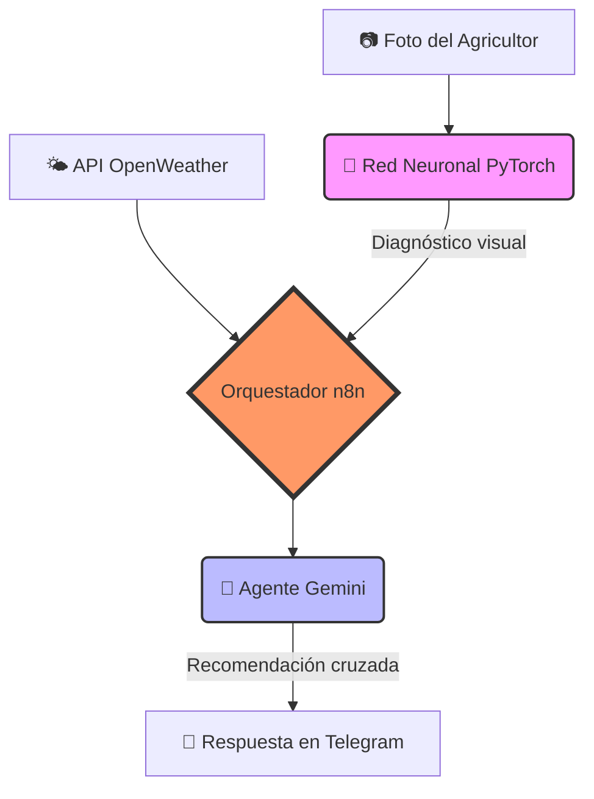
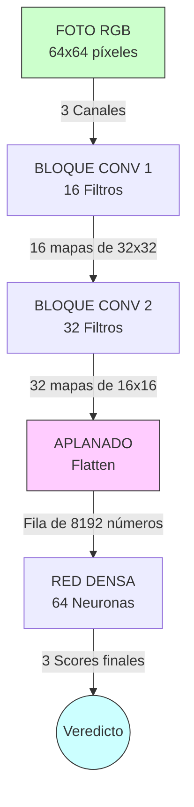
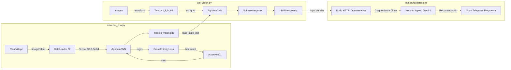

# Guía de Estudio Progresiva — Orquestador Agrícola Neural

> Material organizado de **menos a más técnico**. Estudia en orden y detente donde te sientas cómodo.

---

## Índice

- ⚪ [Nivel 0 — Diccionario de Conceptos Básicos (Analogías) (3 min)](#-nivel-0--diccionario-de-conceptos-básicos-analogías)
- 🟢 [Nivel 1 — ¿Qué hace este proyecto? (5 min)](#-nivel-1--qué-hace-este-proyecto)
- 🟢🟡 [Nivel 1.5 — El sistema por dentro, sin fórmulas (7 min)](#-nivel-15--el-sistema-por-dentro-sin-fórmulas)
- 🟡 [Nivel 2 — La arquitectura de la red (10 min)](#-nivel-2--la-arquitectura-de-la-red)
- 🟡🟠 [Nivel 2.5 — Capas, parámetros y el flujo de datos (13 min)](#-nivel-25--capas-parámetros-y-el-flujo-de-datos)
- 🟠 [Nivel 3 — Cómo aprende la red (15 min)](#-nivel-3--cómo-aprende-la-red)
- 🟠🔴 [Nivel 3.5 — El ciclo de entrenamiento con términos reales (18 min)](#-nivel-35--el-ciclo-de-entrenamiento-con-términos-reales)
- 🔴 [Nivel 4.0 — Matemáticas de la Activación (ReLU vs Sigmoid) (20 min)](#-nivel-40--matemáticas-de-la-activación-relu-vs-sigmoid)
- 🔴 [Nivel 4.1 — Matemáticas del Optimizador (Adam vs SGD) (22 min)](#-nivel-41--matemáticas-del-optimizador-adam-vs-sgd)
- 🔴 [Nivel 4.2 — Matemáticas del Error (CrossEntropy vs MSE) (25 min)](#-nivel-42--matemáticas-del-error-crossentropy-vs-mse)
- 🔴 [Nivel 4.3 — Bugs de Datos y Flujo de Tensores (28 min)](#-nivel-43--bugs-de-datos-y-flujo-de-tensores)
- 🟣 [Nivel 5 — La Orquestación (n8n y Telegram) (30 min)](#-nivel-5--la-orquestación-n8n-y-telegram)
- ⚫ [Nivel 6 — Auditoría completa de hiperparámetros (referencia)](#-nivel-6--auditoría-completa-de-hiperparámetros)
- 📝 [Preguntas de Auto-Evaluación](#-preguntas-de-auto-evaluación)

---

## ⚪ Nivel 0 — Diccionario de Conceptos Básicos (Analogías)

Antes de ver cómo funciona el código, necesitas entender 20 palabras clave de Inteligencia Artificial. Imagina que estás entrenando a un temporero nuevo (el modelo) para que aprenda a reconocer hojas enfermas:

| Concepto Técnico | Analogía Agrícola | Definición Simple (con toque técnico) |
|---|---|---|
| **Dataset** | El álbum de fotos etiquetado | Conjunto de imágenes (`features`) y sus diagnósticos (`labels`) que la red usa para aprender estadísticamente a separar clases. |
| **Época (Epoch)** *(Hiperparámetro)* | Leer el manual completo una vez | Un ciclo completo donde la red procesa el 100% del dataset. Si `EPOCHS=10`, la red iterará 10 veces sobre los datos para minimizar el error. |
| **Lote (Batch)** *(Hiperparámetro)* | La prueba corta | Subconjunto de fotos (ej. 32) que se procesan simultáneamente en memoria antes de actualizar los pesos, estabilizando el aprendizaje. |
| **Tamaño de Imagen (IMG_SIZE)** *(Hiperparámetro)* | La resolución de la lupa | Resolución a la que se redimensionan todas las fotos (ej. 64x64). A mayor tamaño, más detalle, pero mayor consumo de RAM. |
| **Tensor** | La foto convertida a matriz matemática | Estructura de datos multidimensional. Una foto se convierte en un Tensor de forma `[Canales, Alto, Ancho]` con valores numéricos de píxeles. |
| **Pesos (Weights)** | La "experiencia" o intuición | Los parámetros internos (números) que la red multiplica por los datos de entrada. Se ajustan iterativamente durante el entrenamiento. |
| **Loss (Pérdida)** *(Hiperparámetro)* | El medidor de equivocaciones | Una métrica matemática (como `CrossEntropyLoss`) que cuantifica qué tan lejos estuvo la predicción de la red respecto a la etiqueta real. La elección de esta función es un hiperparámetro arquitectónico. |
| **Learning Rate** *(Hiperparámetro)* | El tamaño del paso al caminar | El multiplicador (ej. `0.001`) que define la magnitud con la que el Optimizador actualiza los pesos. Muy alto causa inestabilidad; muy bajo, estancamiento. |
| **Inferencia** | Trabajar solo en el campo | Fase de producción (`model.eval()`) donde se hace un *forward pass* sin calcular gradientes (sin aprender) solo para predecir fotos nuevas. |
| **Overfitting** | Memorizar sin entender (Sobreajuste) | Cuando la red modela el "ruido" de los datos de entrenamiento perdiendo capacidad de generalización frente a imágenes que nunca ha visto. |
| **Dropout** *(Hiperparámetro)* | Vendar ojos al azar | Técnica de regularización que "apaga" aleatoriamente un porcentaje de neuronas (ej. 50%) en cada paso para forzar a la red a no depender de unas pocas conexiones y evitar el Overfitting. |
| **Filtro Convolucional (Kernel)** *(Hiperparámetro)* | La lupa especializada | Una matriz pequeña (ej. 3x3) que se desliza por la imagen calculando productos punto para extraer características (features) como bordes o texturas. |
| **Stride (Paso)** *(Hiperparámetro)* | Los saltos de la lupa | Define cuántos píxeles salta el filtro al moverse por la imagen (ej. Stride=2 reduce el tamaño a la mitad). |
| **Padding (Relleno)** *(Hiperparámetro)* | El marco protector | Ceros que se agregan alrededor del borde de la imagen para que el filtro convolucional no reduzca su tamaño espacial (Padding=1 mantiene el tamaño 64x64). |
| **Canales de Salida** *(Hiperparámetro)* | Cantidad de patrones a buscar | El número de mapas de características que genera una capa (ej. 16 o 32 filtros buscando cosas distintas al mismo tiempo). |
| **Neuronas Ocultas** *(Hiperparámetro)* | Tamaño del comité interno | Cantidad de neuronas en la capa densa intermedia (ej. 256 en tu código `fc1`), determina la "capacidad cerebral" antes de la decisión final. |
| **Número de Clases (Num Classes)** *(Hiperparámetro)* | Las cajas de clasificación | La cantidad de patologías posibles a predecir (14 en el proyecto final). Determina el tamaño de la capa de salida. |
| **Función de Activación** *(Hiperparámetro)* | El umbral de decisión | Una operación matemática no-lineal (como `ReLU: max(0, x)`) que decide si la señal de una neurona es lo bastante fuerte para pasar a la siguiente capa. La elección es un hiperparámetro arquitectónico. |
| **Optimizador (ej. Adam)** *(Hiperparámetro)* | El GPS (Descenso de gradiente) | El algoritmo que usa las derivadas del error para guiar a los pesos hacia su valor óptimo, utilizando momentum para no quedarse atascado. |
| **Momentum** *(Hiperparámetro)* | El vuelo de bajada | Parámetro interno del optimizador Adam (β1=0.9, β2=0.999) que recuerda la inercia de los gradientes anteriores para acelerar el aprendizaje y no estancarse en hoyos locales. |
| **Umbral de Confianza (Threshold)** *(Hiperparámetro de Negocio)* | El filtro de seguridad | Nivel mínimo de probabilidad requerida (ej. 0.65) para aceptar una predicción como válida antes de enviar una alerta, mitigando riesgos operativos. |
| **Desbalance de Clases** | El huerto estadísticamente disparejo | Asimetría en el dataset (1000 fotos de Tizón vs 152 Sanas) que sesga las predicciones del modelo hacia la clase mayoritaria. |
| **Pooling (MaxPool)** | El resumen espacial | Operación de reducción de dimensionalidad (downsampling) que extrae el valor máximo de una región (ej. 2x2), ahorrando RAM y dando invarianza a la posición. |
| **Flatten (Aplanado)** | Desarmar el rompecabezas en fila | Capa que transforma el tensor tridimensional de los mapas de características en un vector unidimensional (1D) para poder inyectarlo a la red densa final. |
| **Backpropagation** | Repartir la culpa matemática | Algoritmo que aplica la "regla de la cadena" desde la salida hacia la entrada para calcular el gradiente (derivada) de cada peso respecto al error (Loss). |
| **Capa Densa (fc1 / fc2)** | El comité de decisiones | Capas "Fully Connected" donde cada neurona conecta con todas las de la capa anterior. `fc1` cruza características visuales (cuello de botella lógico), `fc2` emite el veredicto de clasificación final. |
| **Normalización** *(Utiliza Hiperparámetros)* | Nivelar el terreno estadístico | Re-escalar los valores de los píxeles (usando hiperparámetros de **Media y Varianza**, ej. 0.5) para acelerar la convergencia matemática del gradiente. |
| **Softmax** | El porcentaje de probabilidad | Función que transforma los valores crudos de salida (logits) en una distribución de probabilidades exponencial que suma exactamente 1.0 (100%). |
| **CPU vs GPU** | Un trabajador vs Procesamiento paralelo | La CPU procesa tareas secuenciales complejas. La GPU tiene miles de núcleos paralelos masivos, ideales para las multiplicaciones de matrices de los Tensores. |

---

## 🟢 Nivel 1 — ¿Qué hace este proyecto?

**Sin tecnicismos. Solo el problema y la solución.**

Un agricultor tiene una planta enferma. Toma una foto con el celular. El sistema le dice en segundos qué enfermedad tiene y qué tratamiento aplicar, considerando el clima de su zona.

### Los tres pasos del sistema



### Las tres clases detectadas

| Clase | Qué es | Síntoma visual |
|---|---|---|
| `Planta_Sana` | Sin enfermedad | Verde uniforme |
| `Tizon_Tardio_Papa` | Hongo que destruye papas | Manchas marrones oscuras |
| `Oidio_Vid` | Hongo que afecta uvas | Polvo blanco en la hoja |

### Los dos archivos de código

| Archivo | Qué hace en una frase |
|---|---|
| `entrenar_cnn.py` | Enseña a la red a distinguir estas 3 clases usando miles de fotos |
| `api_vision.py` | Expone la red entrenada como servicio web que recibe fotos y responde diagnósticos |

---


### 📝 Auto-Evaluación (Nivel 1)
<details><summary>¿Cuáles son las 3 clases que el modelo puede distinguir y cómo se ven visualmente?</summary>
Planta_Sana (verde uniforme), Tizon_Tardio_Papa (manchas marrones oscuras) y Oidio_Vid (polvo blanco en la hoja).
</details>

<details><summary>¿Cuál es el rol de Gemini en el sistema?</summary>
Cruza el diagnóstico visual de la CNN con los datos climáticos actuales de la zona para recomendar un tratamiento agronómico contextualizado y seguro (ej. no sugerir químicos de contacto si llueve).
</details>

<details><summary>¿Qué pasa si se pierde el archivo <code>modelo_vision.pth</code>?</summary>
El sistema de inferencia falla porque la red neuronal se queda "vacía", sin los pesos (experiencia) aprendidos durante el entrenamiento. Habría que entrenarla desde cero de nuevo.
</details>

<details><summary>¿Por qué el sistema usa Gemini si ya tiene una Red Neuronal (CNN) para analizar la foto?</summary>
La CNN solo es experta en "ver" e identificar la enfermedad, pero no sabe nada de agronomía ni clima. Gemini actúa como el "agrónomo experto" que le da valor real al agricultor recomendando qué hacer a continuación.
</details>

---

## 🟢🟡 Nivel 1.5 — El sistema por dentro, sin fórmulas

**Introduces los nombres correctos sin entrar en matemáticas.**

### El modelo: qué es y para qué sirve

El corazón del sistema es un **modelo de Deep Learning** llamado `AgricolaCNN`. Un modelo es un programa que, después de ver miles de ejemplos con respuestas correctas, aprende a clasificar imágenes nuevas que nunca ha visto.

El proceso tiene dos fases separadas:
- **Fase 1 — Entrenamiento** (`entrenar_cnn.py`): el modelo aprende mirando fotos etiquetadas. Al terminar, guarda lo aprendido en un archivo llamado `modelo_vision.pth`.
- **Fase 2 — Inferencia** (`api_vision.py`): el modelo cargado en memoria recibe fotos nuevas y predice la clase. No aprende más, solo aplica lo que ya sabe.

### El dataset: los datos de entrenamiento

El modelo aprendió usando el **dataset PlantVillage**: una colección de ~2000 fotos de hojas reales, ya organizadas en carpetas por enfermedad. Cada carpeta es una clase:

```
data/
  Oidio_Vid/         ← ~1000 fotos de hojas con Oídio
  Planta_Sana/       ← ~152 fotos de hojas sanas (papa, tomate y pimiento)
  Tizon_Tardio_Papa/ ← ~1000 fotos de hojas con Tizón
```

> [!TIP]
> **El diseño de "Planta_Sana":** El script `preparar_dataset.py` construye esta clase combinando hojas sanas de papa, tomate y pimiento. Es un concepto clave de Deep Learning: si usáramos solo papa sana, la red podría memorizar que "sano = forma de hoja de papa". Al mezclar especies, obligamos a la red a extraer patrones reales de "salud" (color uniforme, sin manchas) ignorando la forma de la hoja.

> [!NOTE]
> Hay muchas más fotos de Oídio y Tizón que de plantas sanas (152 vs 1000). Esto se llama **desbalance de clases** y es una debilidad conocida del sistema.

### La inferencia: cómo responde en producción

Cuando el agricultor sube una foto, `api_vision.py` sigue estos pasos:
1. Recibe la imagen como archivo binario por HTTP
2. La preprocesa (redimensiona a 64×64, convierte a números)
3. La pasa por el modelo → obtiene 3 scores, uno por enfermedad
4. Selecciona la enfermedad con el score más alto
5. Responde con un JSON: `{"diagnostico": "Oidio_Vid", "confianza": 0.92}`

---


### 📝 Auto-Evaluación (Nivel 1.5)
<details><summary>¿Qué diferencia hay entre entrenamiento e inferencia?</summary>
En el entrenamiento, el modelo aprende ajustando sus parámetros usando miles de ejemplos (toma mucho tiempo y recursos). En la inferencia, el modelo ya no aprende, solo aplica lo aprendido a fotos nuevas para dar una respuesta rápida.
</details>

<details><summary>¿Por qué la clase <code>Planta_Sana</code> mezcla hojas de papa, tomate y pimiento en lugar de usar solo una?</summary>
Para evitar sesgos. Si usáramos solo papa, la red podría aprender que "sano" significa "tener forma de hoja de papa". Al mezclar especies, la forzamos a aprender características reales de salud (color verde, sin manchas).
</details>

<details><summary>¿Qué significa que exista "desbalance de clases" en este dataset?</summary>
Significa que hay muchas más imágenes de enfermedades (1000 de Oídio y 1000 de Tizón) que de plantas sanas (152). Esto puede causar que el modelo se acostumbre a predecir "enfermo" más a menudo de lo que debería.
</details>

<details><summary>¿Qué contiene el JSON que responde <code>api_vision.py</code>?</summary>
Contiene el <code>diagnostico</code> (la clase con mayor probabilidad) y la <code>confianza</code> (un porcentaje entre 0 y 1 indicando qué tan seguro está el modelo).
</details>

---

## 🟡 Nivel 2 — La arquitectura de la red

**Cómo está estructurada la red internamente, con analogías.**

### ¿Qué es una Red Neuronal Convolucional (CNN)?

Imagina que analizas una foto con una lupa pequeña que se mueve por toda la imagen:
- **Primera pasada (16 lupas):** detecta cosas simples — bordes, cambios de color, zonas brillantes
- **Segunda pasada (32 lupas):** combina esos patrones simples y detecta cosas complejas — manchas, texturas irregulares
- **Al final:** con toda esa información resume la imagen y decide la clase

La "lupa" se llama **filtro** o **kernel**. La red tiene 2 bloques de filtros seguidos de un **clasificador** final.

### La arquitectura de AgricolaCNN



### ¿Qué guarda `modelo_vision.pth`?

Guarda todos los **pesos** (valores numéricos) que los filtros y el clasificador aprendieron durante el entrenamiento. Son los ~529,635 números que definen exactamente qué busca cada filtro. Sin este archivo, la red existe como estructura vacía pero no sabe hacer nada.

---


### 📝 Auto-Evaluación (Nivel 2)
<details><summary>¿Qué detecta el Bloque Conv 1 vs el Bloque Conv 2?</summary>
Conv 1 actúa como una lupa básica que detecta características simples como bordes, líneas o cambios bruscos de color. Conv 2 toma esos bordes y los combina para detectar patrones complejos como las manchas redondas del Tizón o la textura del Oídio.
</details>

<details><summary>En tu arquitectura usas MaxPooling después de cada capa convolucional. ¿Cuál es el doble objetivo de achicar la imagen espacialmente?</summary>
Tiene dos grandes objetivos. 1) **Ahorro Computacional:** Hace un "resumen" espacial extrayendo el píxel más fuerte de un cuadrante, reduciendo drásticamente la cantidad de parámetros para que la red no colapse la memoria RAM. 2) **Invarianza Espacial (Traslacional):** Al resumir la región, a la red ya no le importa el píxel exacto donde estaba la mancha de Tizón, solo le importa que la mancha "está ahí". Esto hace al modelo robusto incluso si el agricultor toma la foto un poco movida.
</details>

<details><summary>¿Por qué aumentan las "versiones" (canales) de la imagen a medida que avanzamos?</summary>
Porque en cada paso queremos buscar más características. Pasamos de 3 colores RGB a 16 filtros de patrones, y luego a 32 filtros, permitiendo que la red extraiga información cada vez más rica.
</details>

<details><summary>¿Para qué sirve el aplanado (flatten)?</summary>
Convierte la matriz 2D de píxeles (que viene de las convoluciones) en una sola fila larga (1D) de 8192 números, para que pueda ser inyectada en la red densa (MLP) final que toma la decisión.
</details>

---

## 🟡🟠 Nivel 2.5 — Capas, parámetros y el flujo de datos

**Los mismos conceptos del nivel 2 pero con los nombres técnicos correctos.**

### Tipos de capas en AgricolaCNN

| Capa (código) | Nombre técnico | Qué hace |
|---|---|---|
| `nn.Conv2d` | Capa Convolucional | Aplica filtros deslizantes, extrae features |
| `nn.ReLU` | Función de Activación | Introduce no-linealidad: `f(x) = max(0, x)` |
| `nn.MaxPool2d` | Capa de Pooling | Reduce dimensiones espaciales, guarda el máximo |
| `nn.Linear` | Capa Densa / Fully Connected | Multiplica todos los inputs con todos los pesos |

### Qué son los parámetros (pesos)

Cada filtro convolucional y cada neurona densa tiene **pesos**: valores numéricos que se ajustan durante el entrenamiento. El modelo los aprende solos; nadie los define a mano.

Conteo por capa:
- `conv1`: 448 pesos  
- `conv2`: 4,640 pesos  
- `fc1`: 524,352 pesos ← aquí está el 99% del modelo  
- `fc2`: 195 pesos  
- **Total: 529,635 pesos**

### El flujo de datos como transformación

Cada capa transforma los datos. La forma de los datos se llama **shape** y se escribe como `[dimensiones]`:

```
Imagen original      → PIL [alto, ancho, 3_colores]
Después de Resize    → PIL [64, 64, 3]
Después de ToTensor  → Tensor [3, 64, 64]    ← formato PyTorch: [canales, alto, ancho]
En el batch          → Tensor [32, 3, 64, 64] ← 32 imágenes a la vez
Después de conv1     → Tensor [32, 16, 64, 64] ← 16 feature maps
Después de pool1     → Tensor [32, 16, 32, 32] ← se achicó espacialmente
Después de conv2     → Tensor [32, 32, 32, 32] ← 32 feature maps
Después de pool2     → Tensor [32, 32, 16, 16] ← se achicó de nuevo
Después de Flatten   → Tensor [32, 8192]        ← todo aplanado
Después de fc1       → Tensor [32, 64]
Después de fc2       → Tensor [32, 3]           ← 3 scores por imagen
```

### ¿Por qué se usan mini-batches?

En vez de procesar una foto a la vez, el **DataLoader** agrupa 32 fotos en un **batch** (lote) y las procesa en paralelo. Ventajas:
- Más rápido (operaciones matriciales paralelas)
- Los gradientes se promedian → menos ruidosos → mejor aprendizaje
- Uso eficiente de memoria

---


### 📝 Auto-Evaluación (Nivel 2.5)
<details><summary>¿Por qué es obligatorio usar una capa "Flatten" antes de la primera Capa Densa (fc1)? ¿Qué pasaría si conectáramos la salida convolucional directamente?</summary>
Es obligatorio por un problema de incompatibilidad geométrica (Shape Mismatch). El bloque convolucional entrega un Tensor 3D (Canales, Alto, Ancho). Sin embargo, una Capa Densa clásica solo sabe procesar Tensores 1D (Vectores). Si no usamos Flatten, el código daría error inmediato. El Flatten toma este "cubo 3D" y lo aplana en una sola fila larga (ej. de 8192 números) para que la red lineal pueda realizar su multiplicación de matrices final.
</details>

<details><summary>¿Por qué se procesan 32 fotos juntas (un batch) y no una a la vez?</summary>
Porque es mucho más rápido al usar operaciones matemáticas matriciales en paralelo, y porque promediar el error de 32 fotos a la vez hace que el ajuste de la red (los gradientes) sea mucho más estable que si se ajustara foto por foto.
</details>

<details><summary>¿Qué capa tiene el 99% de los parámetros y por qué?</summary>
La capa <code>fc1</code> (la primera capa lineal post-aplanado). Como conecta los 8192 valores del flattened tensor con 64 neuronas, requiere <code>8192 × 64 = 524,288</code> pesos individuales (conexiones).
</details>

---

## 🟠 Nivel 3 — Cómo aprende la red

**El ciclo de entrenamiento con analogías.**

### La analogía del estudiante con examen

1. **La red ve una foto** → predice una clase (al azar al principio)
2. **Se compara con la respuesta correcta** → se calcula el error llamado **loss**
3. **Se analiza dónde se equivocó** → **backpropagation** encuentra qué pesos fallaron
4. **Se corrigen los pesos** → el **optimizador** los ajusta un poco
5. **Repetir 630 veces** → la red mejora progresivamente

### Épocas y batches

- **Época:** una pasada completa por las ~2000 fotos del dataset
- **Batch:** grupo de 32 fotos procesadas juntas antes de actualizar los pesos
- Cálculo: 2000 fotos ÷ 32 por batch = ~63 batches por época × 10 épocas = **~630 actualizaciones totales**

```
ÉPOCA 1:
  Batch 1 (32 fotos) → loss=2.1 → ajustar pesos
  Batch 2 (32 fotos) → loss=1.9 → ajustar pesos
  ...63 batches...
  Loss promedio: 1.8

ÉPOCA 5:  Loss promedio: 0.8
ÉPOCA 10: Loss promedio: 0.3  ← la red ya aprendió
```

### La función de pérdida (loss)

Es el "puntaje de equivocación". Si la red dice "Planta_Sana" cuando era Tizón, el loss es alto. Si acierta con alta confianza, el loss es casi 0.

| Situación | Loss |
|---|---|
| Muy seguro y correcto (95%) | ~0.05 |
| Inseguro (50%) | ~0.69 |
| Muy seguro pero equivocado (5%) | ~3.0 |

### Inferencia: sin aprendizaje

En producción (`api_vision.py`) **no hay entrenamiento**. La red solo hace el paso hacia adelante una vez y devuelve el resultado. Es mucho más rápido porque no necesita calcular los gradientes.

---


### 📝 Auto-Evaluación (Nivel 3)
<details><summary>Nombra los 5 pasos de cada iteración de entrenamiento en orden.</summary>
1. Limpiar gradientes (zero_grad), 2. Calcular predicción (forward), 3. Calcular error (loss), 4. Calcular gradientes (backward), 5. Actualizar pesos (step).
</details>

<details><summary>¿Cuántas actualizaciones totales ocurren con EPOCHS=10 y BATCH_SIZE=32?</summary>
Con ~2000 fotos divididas en batches de 32, tenemos ~63 batches por época. 63 batches × 10 épocas = ~630 actualizaciones en total.
</details>

<details><summary>¿Qué significa en la práctica que el loss baje de 2.1 a 0.3?</summary>
Significa que la red pasó de estar "adivinando al azar y equivocándose mucho" (Loss 2.1) a "predecir casi siempre la clase correcta con mucha confianza" (Loss 0.3).
</details>

---

## 🟠🔴 Nivel 3.5 — El ciclo de entrenamiento con términos reales

**Los mismos pasos del nivel 3 con los nombres y conceptos técnicos.**

### Los 5 pasos de cada iteración (en código)

```python
optimizer.zero_grad()          # 1. Limpiar gradientes del batch anterior
outputs = model(inputs)        # 2. Forward pass: calcular predicciones
loss = criterion(outputs, labels)  # 3. Calcular la pérdida (CrossEntropyLoss)
loss.backward()                # 4. Backpropagation: calcular gradientes
optimizer.step()               # 5. Actualizar los 529,635 pesos (Adam)
```

### ¿Qué es un gradiente?

Es la dirección y magnitud en que hay que mover cada peso para que el loss baje. Se calcula aplicando la **regla de la cadena** desde la capa de salida hacia la de entrada (de ahí "retro-propagación").

> 🌾 **Analogía del Topógrafo:** Imagina que el "Loss" es la altitud de un cerro con niebla y queremos llegar al valle más profundo (error cero). El gradiente es sentir el suelo con el pie para saber hacia dónde está la bajada.
- Si el pie siente que sube (gradiente positivo) → debes dar un paso atrás (el peso baja).
- Si el pie siente que baja (gradiente negativo) → debes avanzar (el peso sube).
- Si el pie siente plano (~0) → llegaste al fondo del valle (peso ideal).

### CrossEntropyLoss: la función de pérdida

Combina dos operaciones: **LogSoftmax** (convierte scores en log-probabilidades) + **NLLLoss** (penaliza).

Fórmula: `L = -log(P(clase_correcta))`

Ejemplo: si la red asigna 5% de probabilidad a "Tizón" cuando la foto es Tizón:
`L = -log(0.05) = 3.0` → loss alto → el optimizador ajustará mucho los pesos

### El optimizador Adam

**Adam** (Adaptive Moment Estimation) ajusta el learning rate por parámetro. Tiene memoria de cómo se han comportado los gradientes:
- `β₁ = 0.9`: momentum — usa el historial reciente de gradientes
- `β₂ = 0.999`: escala — estabiliza pesos con gradientes muy variables
- `lr = 0.001`: paso base — cuánto moverse en cada actualización

### model.train() vs model.eval()

| Modo | Cuándo | Efecto |
|---|---|---|
| `model.train()` | Durante entrenamiento | Habilita Dropout y BatchNorm actualiza stats (si la red los usara) |
| `model.eval()` | Durante inferencia | Desactiva Dropout, BatchNorm usa stats globales |

### torch.no_grad()

Durante inferencia no se necesita calcular gradientes (no hay backpropagation). `torch.no_grad()` le dice a PyTorch que no construya el grafo computacional → ~50% menos memoria, forward pass más rápido.

---


### 📝 Auto-Evaluación (Nivel 3.5)
<details><summary>¿Qué es un gradiente y en qué dirección modifica un peso?</summary>
Es la magnitud y dirección que indica cómo cambia el error (Loss) si modificas un peso. Si el gradiente es positivo (subiendo), el peso debe disminuir (dar un paso atrás). Si es negativo (bajando), el peso debe aumentar.
</details>

<details><summary>¿Por qué se llama <code>optimizer.zero_grad()</code> antes de cada backward?</summary>
Porque PyTorch por defecto acumula (suma) los gradientes en cada iteración. Si no los limpiamos a cero al inicio del batch, el nuevo gradiente se sumaría al del batch anterior, arruinando la actualización de pesos.
</details>

<details><summary>En su código de producción (API), ¿qué hacen exactamente `model.eval()` y `torch.no_grad()` y por qué apagarlos en entrenamiento sería un error?</summary>
Ambos comandos preparan a la red para la fase de "Inferencia", donde el modelo ya no aprende, solo aplica conocimiento. 1) **`torch.no_grad()`**: Apaga el cálculo de gradientes (derivadas) en el grafo computacional de PyTorch. Como no haremos backpropagation, esto nos ahorra >50% de memoria RAM y acelera el proceso. 2) **`model.eval()`**: Congela las capas que tienen comportamiento aleatorio durante el entrenamiento (como Dropout o BatchNorm), garantizando que si le pasas la misma foto dos veces, la red te dé exactamente el mismo resultado (comportamiento determinista).
</details>

---

## 🔴 Nivel 4.0 — Matemáticas de la Activación (ReLU vs Sigmoid)

**El "por qué" detrás de las funciones de activación.**

| Característica | Sigmoid (Antiguo) | ReLU (Moderno) |
|---|---|---|
| **Efecto en el gradiente** | Lo reduce drásticamente (máx 25% por capa) | Lo mantiene intacto (100%) si es positivo |
| **Problema principal** | *Vanishing Gradient*: las primeras capas no aprenden | *Dying ReLU*: algunas neuronas pueden "morir" (aquí no es grave) |
| **Velocidad de cálculo** | Lenta (exponenciales) | Muy rápida (max(0, x)) |

**Vanishing Gradient Problem:** en redes con múltiples capas, los gradientes se multiplican por la derivada de la activación en cada capa hacia atrás.

> 🌾 **Analogía del Teléfono Descompuesto:** El error (gradiente) viaja desde el jefe (capa de salida) hasta el primer operario (capa de entrada). `Sigmoid` es como un trabajador que susurra: cada vez que pasa el mensaje, le baja el volumen a un 25%. Al llegar al inicio, no se escucha nada y el primer operario no corrige su trabajo. `ReLU` es un trabajador que transmite el mensaje con el volumen intacto (100%), asegurando que todos aprendan.

- `Sigmoid'(x) ≤ 0.25` → después de 3 capas: `0.25³ = 0.016` → gradiente casi nulo → `conv1` no aprende nada
- `ReLU'(x) = 1` para x > 0 → gradiente sin reducción → todas las capas aprenden

### 📝 Auto-Evaluación (Nivel 4.0)
<details><summary>Basado en el cálculo de derivadas, ¿cuál es la ventaja matemática principal de usar ReLU sobre Sigmoid para evitar el 'Vanishing Gradient'?</summary>
La ventaja es que ReLU transmite la información (el gradiente de error) de forma íntegra hacia las primeras capas. El problema histórico de Sigmoide es que su derivada máxima es 0.25, lo que significa que cada vez que el error cruza una capa hacia atrás, pierde el 75% de su fuerza, "desvaneciéndose" antes de llegar al inicio. La derivada de ReLU para números positivos es exactamente 1, permitiendo que el gradiente viaje intacto al 100% por toda la red, garantizando que las primeras capas aprendan.
</details>

---

## 🔴 Nivel 4.1 — Matemáticas del Optimizador (Adam vs SGD)

**El "por qué" detrás del algoritmo de aprendizaje.**

| Característica | SGD (Descenso de Gradiente Estocástico) | Adam (Adaptive Moment Estimation) |
|---|---|---|
| **Learning Rate (lr)** | El mismo para todos los pesos | Ajustado dinámicamente para cada peso individual |
| **Memoria (Momentum)** | No (en su forma pura) | Sí, recuerda gradientes pasados para no estancarse |
| **Velocidad de convergencia**| Lenta, requiere miles de épocas | Muy rápida, ideal para entrenamientos cortos (como nuestras 10 épocas) |

SGD: `w = w - lr × ∂L/∂w` (mismo lr para todos)

Adam: `w = w - lr × m̂ / (√v̂ + ε)` donde:
- `m̂ = β₁·m + (1-β₁)·g` → promedio móvil del gradiente (momentum)
- `v̂ = β₂·v + (1-β₂)·g²` → promedio móvil del gradiente² (escala adaptativa)

**Resultado:** con solo 630 actualizaciones disponibles, Adam converge donde SGD todavía está calentando.

### 📝 Auto-Evaluación (Nivel 4.1)
<details><summary>Sabiendo que su red tiene muy pocas actualizaciones (10 épocas), ¿por qué eligió Adam en lugar del clásico algoritmo SGD?</summary>
Elegí Adam porque tiene dos propiedades matemáticas clave para un entrenamiento corto: 1) **Adaptive Learning Rate:** SGD aplica un tamaño de paso ciego y fijo para todos los parámetros de la red. Adam ajusta dinámicamente el paso para cada peso de forma individual. 2) **Momentum:** Adam recuerda el historial de gradientes anteriores para darle inercia a la red y no quedarse atascada. Gracias a esto, Adam logra la convergencia matemática rapidísimo (en solo 10 épocas), mientras que SGD necesitaría miles de épocas de gasto computacional para lograr la misma precisión.
</details>

---

## 🔴 Nivel 4.2 — Matemáticas del Error (CrossEntropy vs MSE)

**El "por qué" detrás de cómo castigamos a la red.**

| Función de Pérdida | Uso Principal | Cómo penaliza el error |
|---|---|---|
| **MSE (Mean Squared Error)** | Regresión (predecir números continuos, ej. precio de una casa) | Error al cuadrado (suave) |
| **CrossEntropyLoss** | Clasificación (predecir etiquetas, ej. clases de plantas) | Logarítmico (castigo extremo si está confiado y equivocado) |

MSE es para regresión (valores continuos). Para clasificación, la "respuesta correcta" es una etiqueta discreta (0, 1 o 2). CrossEntropyLoss está diseñada para probabilidades: penaliza exponencialmente cuando el modelo está muy confiado pero equivocado.

> 🌾 **Analogía del Estudiante Arrogante:** Si un aprendiz se equivoca pero admite "no estoy muy seguro", el reto es leve. Pero si se equivoca gritando "¡Estoy 100% seguro de que esta hoja con hongos está SANA!", la *CrossEntropy* le aplica un castigo monumental (Loss enorme) para quitarle la arrogancia rápidamente y forzar un cambio brusco en sus pesos.

### 📝 Auto-Evaluación (Nivel 4.2)
<details><summary>Si un colega sugiere cambiar CrossEntropyLoss por MSE (Error Cuadrático Medio), ¿por qué sería un error matemático grave para este proyecto?</summary>
Sería un error porque MSE está diseñado para problemas de **Regresión** (predecir valores continuos como la temperatura). Nuestro proyecto es de **Clasificación** (predecir categorías discretas). Matemáticamente, CrossEntropy trabaja con probabilidades y aplica un "castigo extremo" (logarítmico) cuando la red se equivoca estando muy confiada. Si la red dice estar 99% segura de una enfermedad incorrecta, CrossEntropy dispara el error para forzar una corrección rápida de los pesos, algo que el MSE haría de forma muy lenta y suave.
</details>

---

## 🔴 Nivel 4.3 — Bugs de Datos y Flujo de Tensores

**Detalles técnicos que causan errores catastróficos si no se cuidan.**

### El bug de CLASS_NAMES (caso de estudio real)

`ImageFolder` asigna etiquetas en orden **alfabético** de los subdirectorios:
```
data/Oidio_Vid/         → índice 0
data/Planta_Sana/       → índice 1
data/Tizon_Tardio_Papa/ → índice 2
```

Si `CLASS_NAMES` en `api_vision.py` tuviese otro orden, el modelo predice índice 0 (Oídio) pero el código devolvería "Planta_Sana". El modelo funciona bien, pero las etiquetas están cruzadas. **Este bug ocurrió y fue corregido en Sesión 2.**

### Flujo completo de tensores con shapes

```
PIL [H, W, 3]  →  Resize  →  PIL [64, 64, 3]
  →  ToTensor  →  Tensor [3, 64, 64]   rango [0,1]
  →  Normalize →  Tensor [3, 64, 64]   rango [-1,1]
  →  DataLoader →  Tensor [32, 3, 64, 64]

  →  conv1(3→16, k=3, p=1) →  [32, 16, 64, 64]
  →  relu1                 →  [32, 16, 64, 64]
  →  pool1(2×2)            →  [32, 16, 32, 32]
  →  conv2(16→32, k=3, p=1)→  [32, 32, 32, 32]
  →  relu2                 →  [32, 32, 32, 32]
  →  pool2(2×2)            →  [32, 32, 16, 16]
  →  flatten               →  [32, 8192]   (32×16×16=8192)
  →  fc1(8192→64)          →  [32, 64]
  →  relu3                 →  [32, 64]
  →  fc2(64→3)             →  [32, 3]      ← logits
  →  CrossEntropyLoss      →  []           ← escalar (loss)
```

### 📝 Auto-Evaluación (Nivel 4.3)
<details><summary>¿Qué pasaría si cambiamos el orden de la lista estática <code>CLASS_NAMES</code> en producción por un tema estético?</summary>
Provocaría un cruce de etiquetas gravísimo. La red neuronal no predice texto, predice números (índices 0, 1 o 2). Durante el entrenamiento, la función `ImageFolder` de PyTorch asignó esos índices en estricto orden alfabético a las carpetas (Oidio es 0). Si en producción ponemos a 'Planta_Sana' de primero en la lista, tomará el índice 0. Cuando ingrese una foto de Oídio, la red predecirá perfectamente el '0', pero nuestro código lo traducirá equivocadamente a 'Planta_Sana'. Por ende, ese orden jamás debe alterarse por estética.
</details>

<details><summary>¿Qué pasaría si <code>IMG_SIZE=128</code> en entrenamiento y <code>64</code> en inferencia?</summary>
El código de inferencia daría error ("Shape mismatch") en la capa Densa (fc1). Los filtros convolucionales achicarían una imagen de 128x128 a una matriz de 32x32, generando 32,768 valores en el flatten, pero la red fue entrenada para recibir exactamente 8192.
</details>

---

## 🟣 Nivel 5 — La Orquestación (n8n y Telegram)

**Objetivo:** Entender cómo se conectan los distintos servicios (APIs) en un flujo automatizado sin código, creando el ecosistema completo del proyecto.

### ¿Qué es n8n y por qué usarlo?
`n8n` es una herramienta de automatización de flujos de trabajo (workflow automation). En este proyecto actúa como el **"director de orquesta"**: recibe mensajes de Telegram, delega el análisis visual a tu API de PyTorch, pide el clima a otra API, y envía todo a Gemini para formular un tratamiento experto. Permite escalar y modificar el flujo sin tocar el código fuente de los modelos de IA.

### El flujo del Bot (Ubicación Dinámica)

Basado en el archivo `n8n_workflow_telegram_ubicacion.json`, el flujo exacto de nodos tiene esta lógica de negocio:

1. **Telegram Trigger:** Escucha nuevos mensajes del agricultor.
2. **Enrutamiento (Nodos IF):**
   - **IF `text == /start`:** Envía un mensaje de bienvenida con un teclado especial para solicitar ubicación GPS.
   - **IF `location exists`:** Guarda la latitud/longitud en la memoria de la sesión.
   - **IF `photo exists`:** Descarga el archivo de imagen enviado por el agricultor.
3. **Inferencia Visual (Nodo HTTP):** Envía la foto (como `multipart/form-data`) al endpoint `/predecir_muestra` de tu API local. Recupera las variables `diagnóstico` y `confianza`.
4. **Clima Local (Nodo HTTP):** Usa las coordenadas guardadas para consultar la temperatura y humedad actual en la API de OpenWeather.
5. **Agente Agrónomo (Nodo Gemini):** Se construye un *Prompt* dinámico inyectando los datos de la CNN y del clima. 
   - **Reglas del prompt:** Si el clima reporta "lluvia", Gemini tiene estrictamente prohibido recomendar pesticidas de contacto. Si la confianza de la CNN es menor a `0.65`, el Agente desecha el diagnóstico y pide una foto más clara.
6. **Respuesta Telegram:** Envía el veredicto final, redactado por Gemini, de vuelta al celular del usuario.

Con esto se logra una arquitectura limpia de **3 capas desacopladas**: UI (Telegram) ↔ Orquestador (n8n) ↔ Modelos Especializados (CNN PyTorch + Gemini).

---


### 📝 Auto-Evaluación (Nivel 5)
<details><summary>¿Qué rol exacto cumple n8n en tu arquitectura y por qué decidiste usarlo en lugar de programar todo el bot de Telegram directamente en Python?</summary>
El principio clave de diseño aquí es el **desacoplamiento**. Si programara todo junto en un solo script, el modelo de IA (la CNN) quedaría fuertemente atado a la interfaz de usuario (Telegram). Al usar n8n, divido el sistema en 3 capas independientes: La Interfaz, Los Modelos Expertos (FastAPI/Gemini) y el Orquestador. n8n actúa como "Director de Orquesta" encargándose exclusivamente de enrutar la información. Esto mantiene el código Python limpio, enfocado 100% en la predicción visual, y hace que la arquitectura sea altamente escalable (ej. cambiar Telegram por WhatsApp en el futuro sería trivial).
</details>

<details><summary>Si el modelo devuelve un diagnóstico pero con una confianza muy baja (ej. 45%), ¿qué responde Gemini y por qué diseñaste esta regla de negocio en n8n?</summary>
En ese escenario, Gemini **no** recomendará ningún tratamiento. Le responderá al agricultor que la foto no es concluyente y le pedirá una imagen más clara. Diseñé esta regla (umbral de confianza del 0.65) como un mecanismo de seguridad crítico. En la agricultura, recomendar un pesticida tóxico basándose en una "adivinanza" del modelo (baja confianza) podría arruinar un cultivo real. A nivel de arquitectura de software, es preferible forzar al usuario a repetir la acción antes que entregar un falso positivo peligroso.
</details>

<details><summary>Nombra al menos 3 APIs o servicios con los que se comunica el orquestador durante una ejecución.</summary>
1) La API de Telegram (para recibir/enviar el chat), 2) La API de PyTorch Local (FastAPI) para el diagnóstico visual, 3) OpenWeather API (para el clima), y 4) Google Gemini API (para redactar el tratamiento experto).
</details>

---

## ⚫ Nivel 6 — Auditoría Completa de Hiperparámetros

**Referencia rápida. Usa esto para responder preguntas específicas.**

### Hiperparámetros de Entrenamiento

| Parámetro | Valor | Archivo | Justificación |
|---|---|---|---|
| `IMG_SIZE` | `64` | `entrenar_cnn.py:57` | Compromiso CPU/resolución. 224 requiere GPU. |
| `BATCH_SIZE` | `32` | `entrenar_cnn.py:64` | Estándar empírico. Menor=ruidoso, mayor=más RAM. |
| `EPOCHS` | `10` | `entrenar_cnn.py:72` | ~630 actualizaciones. Conservador anti-overfitting. |
| `lr` | `0.001` | `entrenar_cnn.py:307` | Default Adam (Kingma & Ba, 2014). |
| `Normalize μ,σ` | `(0.5,0.5,0.5)` | ambos archivos | Reescala [0,1]→[-1,1]. Genérico. |

### Hiperparámetros de Arquitectura

| Parámetro | Valor | Archivo | Justificación |
|---|---|---|---|
| `conv1 out_channels` | `16` | `:185` | Features simples. Estándar para dataset pequeño. |
| `conv2 out_channels` | `32` | `:206` | Patrón VGG: duplicar filtros por profundidad. |
| `kernel_size` | `3×3` | `:185,206` | Mínimo efectivo. Menos params que 5×5. |
| `padding` | `1` | `:185,206` | Same padding: mantiene dims espaciales. |
| `MaxPool stride` | `2` | `:199,209` | Reduce 50%/bloque. Invarianza traslacional. |
| `fc1` | `8192→64` | `:221` | Cuello de botella. 99% de todos los params. |
| `fc2` | `64→3` | `:229` | 3 logits = 3 clases. Sin activación. |

### Parámetros Totales

| Capa | Cálculo | Params |
|---|---|---|
| conv1 | `(3×16×3×3)+16` | 448 |
| conv2 | `(16×32×3×3)+32` | 4,640 |
| fc1 | `(8192×64)+64` | 524,352 |
| fc2 | `(64×3)+3` | 195 |
| **TOTAL** | | **529,635** |

### Trazabilidad Inter-Archivo



### Áreas de Mejora

| Área | Problema | Solución |
|---|---|---|
| Regularización | Sin Dropout | `nn.Dropout(0.5)` entre fc1 y fc2 |
| Augmentation | Sin variaciones | `RandomHorizontalFlip`, `RandomRotation` |
| Desbalance | 152 vs 1000 imgs | `WeightedRandomSampler` |
| Validación | Sin split train/val | `random_split` 80/20 |
| Arquitectura | fc1 = 524K params | Global Average Pooling |

---

### 📝 Auto-Evaluación (Nivel 6)
<details><summary>¿Por qué usar una CNN en lugar de un Perceptrón Multicapa (MLP) estándar para procesar estas imágenes?</summary>
Un MLP aplanaría la imagen inmediatamente, destruyendo la relación espacial (el píxel de arriba no tendría relación con el de abajo). La CNN usa filtros 2D que deslizan por la foto, preservando la geometría y buscando patrones locales como manchas y bordes.
</details>

<details><summary>¿Por qué se eligieron los hiperparámetros actuales (IMG_SIZE=64, BATCH_SIZE=32, EPOCHS=10) y qué pasaría si los alteramos drásticamente?</summary>
Fueron elegidos por ser un compromiso entre precisión y costo computacional (entrenable en CPU de un laptop). Si usamos IMG_SIZE=224, colapsaría la memoria sin GPU. Si usamos EPOCHS=100 en un dataset tan chico, la red se memorizaría las fotos (Overfitting).
</details>

<details><summary>¿Qué riesgo estadístico corremos al entrenar con un desbalance de clases tan severo (1000 Enfermas vs 152 Sanas) y cómo lo mitigarías?</summary>
El riesgo principal es el **sesgo estadístico**. La red podría adoptar un comportamiento "perezoso", aprendiendo a predecir siempre una enfermedad solo por probabilidad estadística, perdiendo la capacidad de distinguir sutilmente una hoja sana. Para mitigarlo, usaría dos enfoques: 1) A nivel de Datos: aplicaría técnicas de *Data Augmentation* (rotar y voltear las 152 fotos sanas) para multiplicarlas artificialmente. 2) A nivel de Código: usaría un `WeightedRandomSampler` en PyTorch, forzando al DataLoader a extraer imágenes sanas con mayor probabilidad matemática durante el entrenamiento.
</details>

<details><summary>Más allá del código actual, ¿qué mejora arquitectónica le harías a la CNN para reducir sus parámetros (peso en MB)?</summary>
Cambiaría el "Flatten" por "Global Average Pooling". Actualmente la primera capa densa tiene más de 500,000 parámetros. Al hacer pooling global, promediamos cada canal reduciendo los parámetros drásticamente sin perder precisión, haciendo el modelo mucho más ligero.
</details>

> [!TIP]
> Para la disertación: domina **Niveles 1 al 3** y el **Nivel 5 (Orquestador)** para explicar con fluidez el ecosistema completo. Prepara **3.5** para preguntas del evaluador. **4 y 6** son para casos donde el profesor profundice mucho.

---

## 🏆 Nivel 7 — Criterio Profesional (Preguntas Capciosas de Comisión)

**Estas preguntas evalúan tu toma de decisiones como Ingeniero, más que tu código.**

<details><summary>Veo que usó todo su dataset de ~2000 fotos para entrenar. Las buenas prácticas dictan que uno debe dividir el dataset en Entrenamiento y Validación (Train/Val Split). ¿Por qué no lo hizo y qué riesgo conlleva?</summary>
"Profesor, por limitaciones de tiempo y volumen de datos (la clase Sana solo tiene 152 fotos) usé todo para entrenamiento. El riesgo es que no puedo saber si el modelo sufre de *Overfitting* (memorización) hasta que lo pruebo en producción con fotos nuevas. Si tuviera más tiempo y volumen, implementaría un `random_split` de 80/20 en PyTorch."
</details>

<details><summary>Si ya está usando Gemini al final del flujo, ¿por qué se tomó la molestia de entrenar una red neuronal PyTorch en su computadora? ¿No era más fácil enviarle la foto directamente a Gemini Vision?</summary>
"Por tres motivos críticos en la industria: **Costo, Privacidad y Especialización**. Llamar a la API de Google Vision con imágenes es muy caro y lento. Mi CNN local procesa la imagen gratis, en milisegundos y de forma privada. Solo uso a Gemini para procesar texto, combinando lo mejor de ambos mundos: la eficiencia y privacidad matemática local con el lenguaje natural de Google."
</details>

<details><summary>Si le diera presupuesto ilimitado en servidores con tarjetas de video (GPUs), ¿qué hiperparámetros de su modelo subiría primero para mejorar la precisión y por qué no lo hizo ahora?</summary>
"Subiría la resolución de las imágenes (`IMG_SIZE`) de 64x64 a 224x224 para capturar más detalles visuales, y aumentaría el `BATCH_SIZE` a 64 o 128 para estabilizar y promediar mejor el error. No lo hice ahora porque entrenar matrices de 224x224 usando la CPU de un notebook colapsaría la memoria RAM en la primera iteración."
</details>

> [!IMPORTANT]
> Para la disertación: domina **Niveles 1 al 3** y el **Nivel 5 (Orquestador)** para explicar con fluidez el ecosistema. Prepara **3.5** para defender tu código en vivo. **4, 6 y 7** son tu escudo indestructible para la ronda final de preguntas de la comisión.
