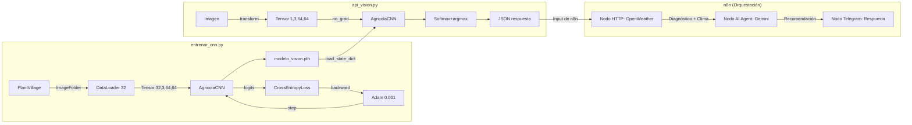

# Guía de Estudio Progresiva — Orquestador Agrícola Neural

> Material organizado de **menos a más técnico**. Estudia en orden y detente donde te sientas cómodo.

---

## Índice

- ⚪ [Nivel 0 — Diccionario de Conceptos Básicos (Analogías) (3 min)](#-nivel-0--diccionario-de-conceptos-básicos-analogías)
- 🟢 [Nivel 1 — ¿Qué hace este proyecto? (5 min)](#-nivel-1--qué-hace-este-proyecto)
- 🟢🟡 [Nivel 1.5 — El sistema por dentro, sin fórmulas (7 min)](#-nivel-15--el-sistema-por-dentro-sin-fórmulas)
- 🟡 [Nivel 2 — La arquitectura de la red (10 min)](#-nivel-2--la-arquitectura-de-la-red)
- 🟡🟠 [Nivel 2.5 — Capas, parámetros y el flujo de datos (13 min)](#-nivel-25--capas-parámetros-y-el-flujo-de-datos)
- 🟠 [Nivel 3 — Cómo aprende la red (15 min)](#-nivel-3--cómo-aprende-la-red)
- 🟠🔴 [Nivel 3.5 — El ciclo de entrenamiento con términos reales (18 min)](#-nivel-35--el-ciclo-de-entrenamiento-con-términos-reales)
- 🔴 [Nivel 4 — Fundamentos matemáticos y decisiones de diseño (25 min)](#-nivel-4--fundamentos-matemáticos-y-decisiones-de-diseño)
- 🟣 [Nivel 5 — La Orquestación (n8n y Telegram) (30 min)](#-nivel-5--la-orquestación-n8n-y-telegram)
- ⚫ [Nivel 6 — Auditoría completa de hiperparámetros (referencia)](#-nivel-6--auditoría-completa-de-hiperparámetros)
- 📝 [Preguntas de Auto-Evaluación](#-preguntas-de-auto-evaluación)

---

## ⚪ Nivel 0 — Diccionario de Conceptos Básicos (Analogías)

Antes de ver cómo funciona el código, necesitas entender 13 palabras clave de Inteligencia Artificial. Imagina que estás entrenando a un temporero nuevo (el modelo) para que aprenda a reconocer hojas enfermas:

| Concepto Técnico | Analogía Agrícola | Definición Simple |
|---|---|---|
| **Dataset** | El álbum de fotos | Todas las imágenes y etiquetas (ej. "Sana", "Tizón") que usamos para enseñarle al sistema. |
| **Época (Epoch)** | Leer el manual completo una vez | Cuando la red neuronal revisa el 100% de las imágenes de entrenamiento *una vez*. Si `EPOCHS=10`, la red lee el libro entero 10 veces para memorizar mejor. |
| **Lote (Batch)** | La prueba corta | Cuántas fotos mira antes de hacer una prueba y corregir sus errores. Si `BATCH_SIZE=32`, mira 32 hojas, intenta adivinar qué son, y luego se corrige a sí misma. |
| **Tensor** | La foto convertida a números | El computador no entiende "hoja verde". Un tensor es una matriz gigante de números que representa el nivel de brillo y los colores de cada píxel de la foto. |
| **Pesos (Weights)** | La intuición o "experiencia" | Son los millones de números internos que la red ajusta tras equivocarse. Si falla, cambia sus "pesos" hasta volverse un experto visual. |
| **Loss (Pérdida)** | El reto o castigo | Un puntaje que mide qué tan equivocada estuvo la red. El objetivo principal del entrenamiento es empujar este número hacia el cero. |
| **Learning Rate** | El tamaño del paso | Qué tan rápido dejamos que la red cambie de opinión tras un error. Si es muy grande, se vuelve inestable; si es muy chico, el entrenamiento no termina nunca. |
| **Inferencia** | Trabajar solo en el campo | Cuando el entrenamiento termina y por fin usamos el modelo para analizar fotos nuevas enviadas por el agricultor. |
| **Overfitting** | Memorizar sin entender | El peor defecto de la IA: cuando el modelo se memoriza las fotos del entrenamiento a la perfección, pero si le pasas la foto de otro huerto distinto, falla horriblemente. |
| **Filtro Convolucional** | La lupa especializada | Una cuadrícula matemática que recorre la foto buscando características muy específicas, como cambios bruscos de color, bordes o manchas. |
| **Función de Activación** | El interruptor de luz | Decide si la información que encontró la lupa es lo suficientemente importante (se "enciende") como para dejarla pasar a la siguiente capa. |
| **Optimizador (ej. Adam)** | El GPS | El algoritmo que guía a la red paso a paso, indicándole exactamente en qué dirección debe cambiar sus pesos para equivocarse menos. |
| **Desbalance de Clases** | El huerto disparejo | El problema de enseñarle a la red 1000 fotos de Tizón pero solo 100 fotos Sanas. La red se acostumbra a predecir "Tizón" solo por estadística. |

---

## 🟢 Nivel 1 — ¿Qué hace este proyecto?

**Sin tecnicismos. Solo el problema y la solución.**

Un agricultor tiene una planta enferma. Toma una foto con el celular. El sistema le dice en segundos qué enfermedad tiene y qué tratamiento aplicar, considerando el clima de su zona.

### Los tres pasos del sistema

```
📷 Foto de la hoja
       │
       ▼
🧠 Red Neuronal — analiza la imagen como un experto visual
       │ "Es Oídio, confianza 92%"
       ▼
🌤️ API del Clima — consulta temperatura y humedad
       │
       ▼
🤖 Gemini (IA de Google) — cruza diagnóstico + clima → recomienda tratamiento
       │
       ▼
💬 Respuesta al agricultor (web o Telegram)
```

### Las tres clases detectadas

| Clase | Qué es | Síntoma visual |
|---|---|---|
| `Planta_Sana` | Sin enfermedad | Verde uniforme |
| `Tizon_Tardio_Papa` | Hongo que destruye papas | Manchas marrones oscuras |
| `Oidio_Vid` | Hongo que afecta uvas | Polvo blanco en la hoja |

### Los dos archivos de código

| Archivo | Qué hace en una frase |
|---|---|
| `entrenar_cnn.py` | Enseña a la red a distinguir estas 3 clases usando miles de fotos |
| `api_vision.py` | Expone la red entrenada como servicio web que recibe fotos y responde diagnósticos |

---


### 📝 Auto-Evaluación (Nivel 1)
<details><summary>¿Cuáles son las 3 clases que el modelo puede distinguir y cómo se ven visualmente?</summary>
Planta_Sana (verde uniforme), Tizon_Tardio_Papa (manchas marrones oscuras) y Oidio_Vid (polvo blanco en la hoja).
</details>

<details><summary>¿Cuál es el rol de Gemini en el sistema?</summary>
Cruza el diagnóstico visual de la CNN con los datos climáticos actuales de la zona para recomendar un tratamiento agronómico contextualizado y seguro (ej. no sugerir químicos de contacto si llueve).
</details>

<details><summary>¿Qué pasa si se pierde el archivo <code>modelo_vision.pth</code>?</summary>
El sistema de inferencia falla porque la red neuronal se queda "vacía", sin los pesos (experiencia) aprendidos durante el entrenamiento. Habría que entrenarla desde cero de nuevo.
</details>

<details><summary>¿Por qué el sistema usa Gemini si ya tiene una Red Neuronal (CNN) para analizar la foto?</summary>
La CNN solo es experta en "ver" e identificar la enfermedad, pero no sabe nada de agronomía ni clima. Gemini actúa como el "agrónomo experto" que le da valor real al agricultor recomendando qué hacer a continuación.
</details>

---

## 🟢🟡 Nivel 1.5 — El sistema por dentro, sin fórmulas

**Introduces los nombres correctos sin entrar en matemáticas.**

### El modelo: qué es y para qué sirve

El corazón del sistema es un **modelo de Deep Learning** llamado `AgricolaCNN`. Un modelo es un programa que, después de ver miles de ejemplos con respuestas correctas, aprende a clasificar imágenes nuevas que nunca ha visto.

El proceso tiene dos fases separadas:
- **Fase 1 — Entrenamiento** (`entrenar_cnn.py`): el modelo aprende mirando fotos etiquetadas. Al terminar, guarda lo aprendido en un archivo llamado `modelo_vision.pth`.
- **Fase 2 — Inferencia** (`api_vision.py`): el modelo cargado en memoria recibe fotos nuevas y predice la clase. No aprende más, solo aplica lo que ya sabe.

### El dataset: los datos de entrenamiento

El modelo aprendió usando el **dataset PlantVillage**: una colección de ~2000 fotos de hojas reales, ya organizadas en carpetas por enfermedad. Cada carpeta es una clase:

```
data/
  Oidio_Vid/         ← ~1000 fotos de hojas con Oídio
  Planta_Sana/       ← ~152 fotos de hojas sanas (papa, tomate y pimiento)
  Tizon_Tardio_Papa/ ← ~1000 fotos de hojas con Tizón
```

> [!TIP]
> **El diseño de "Planta_Sana":** El script `preparar_dataset.py` construye esta clase combinando hojas sanas de papa, tomate y pimiento. Es un concepto clave de Deep Learning: si usáramos solo papa sana, la red podría memorizar que "sano = forma de hoja de papa". Al mezclar especies, obligamos a la red a extraer patrones reales de "salud" (color uniforme, sin manchas) ignorando la forma de la hoja.

> [!NOTE]
> Hay muchas más fotos de Oídio y Tizón que de plantas sanas (152 vs 1000). Esto se llama **desbalance de clases** y es una debilidad conocida del sistema.

### La inferencia: cómo responde en producción

Cuando el agricultor sube una foto, `api_vision.py` sigue estos pasos:
1. Recibe la imagen como archivo binario por HTTP
2. La preprocesa (redimensiona a 64×64, convierte a números)
3. La pasa por el modelo → obtiene 3 scores, uno por enfermedad
4. Selecciona la enfermedad con el score más alto
5. Responde con un JSON: `{"diagnostico": "Oidio_Vid", "confianza": 0.92}`

---


### 📝 Auto-Evaluación (Nivel 1.5)
<details><summary>¿Qué diferencia hay entre entrenamiento e inferencia?</summary>
En el entrenamiento, el modelo aprende ajustando sus parámetros usando miles de ejemplos (toma mucho tiempo y recursos). En la inferencia, el modelo ya no aprende, solo aplica lo aprendido a fotos nuevas para dar una respuesta rápida.
</details>

<details><summary>¿Por qué la clase <code>Planta_Sana</code> mezcla hojas de papa, tomate y pimiento en lugar de usar solo una?</summary>
Para evitar sesgos. Si usáramos solo papa, la red podría aprender que "sano" significa "tener forma de hoja de papa". Al mezclar especies, la forzamos a aprender características reales de salud (color verde, sin manchas).
</details>

<details><summary>¿Qué significa que exista "desbalance de clases" en este dataset?</summary>
Significa que hay muchas más imágenes de enfermedades (1000 de Oídio y 1000 de Tizón) que de plantas sanas (152). Esto puede causar que el modelo se acostumbre a predecir "enfermo" más a menudo de lo que debería.
</details>

<details><summary>¿Qué contiene el JSON que responde <code>api_vision.py</code>?</summary>
Contiene el <code>diagnostico</code> (la clase con mayor probabilidad) y la <code>confianza</code> (un porcentaje entre 0 y 1 indicando qué tan seguro está el modelo).
</details>

---

## 🟡 Nivel 2 — La arquitectura de la red

**Cómo está estructurada la red internamente, con analogías.**

### ¿Qué es una Red Neuronal Convolucional (CNN)?

Imagina que analizas una foto con una lupa pequeña que se mueve por toda la imagen:
- **Primera pasada (16 lupas):** detecta cosas simples — bordes, cambios de color, zonas brillantes
- **Segunda pasada (32 lupas):** combina esos patrones simples y detecta cosas complejas — manchas, texturas irregulares
- **Al final:** con toda esa información resume la imagen y decide la clase

La "lupa" se llama **filtro** o **kernel**. La red tiene 2 bloques de filtros seguidos de un **clasificador** final.

### La arquitectura de AgricolaCNN

```
FOTO (64×64 píxeles, 3 canales RGB)
    │
    ▼ BLOQUE CONV 1: 16 filtros buscan patrones simples
    │   La imagen mantiene su tamaño (64×64) pero ahora tiene 16 "versiones"
    │   Luego se achica a la mitad → 32×32  (operación: MaxPooling)
    │
    ▼ BLOQUE CONV 2: 32 filtros buscan patrones complejos
    │   La imagen sigue siendo 32×32 pero ahora tiene 32 "versiones"
    │   Luego se achica a la mitad → 16×16  (operación: MaxPooling)
    │
    ▼ APLANADO (Flatten): convierte la cuadrícula en una lista
    │   32 versiones × 16×16 píxeles = 8192 números en fila
    │
    ▼ CLASIFICADOR (Red Densa / MLP): reduce y decide
    │   8192 números → 64 neuronas → 3 scores finales
    │
    ▼ El score más alto gana → "Oidio_Vid con 92%"
```

### ¿Qué guarda `modelo_vision.pth`?

Guarda todos los **pesos** (valores numéricos) que los filtros y el clasificador aprendieron durante el entrenamiento. Son los ~529,635 números que definen exactamente qué busca cada filtro. Sin este archivo, la red existe como estructura vacía pero no sabe hacer nada.

---


### 📝 Auto-Evaluación (Nivel 2)
<details><summary>¿Qué detecta el Bloque Conv 1 vs el Bloque Conv 2?</summary>
Conv 1 actúa como una lupa básica que detecta características simples como bordes, líneas o cambios bruscos de color. Conv 2 toma esos bordes y los combina para detectar patrones complejos como las manchas redondas del Tizón o la textura del Oídio.
</details>

<details><summary>En tu arquitectura usas MaxPooling. ¿Por qué se "achica" la imagen espacialmente?</summary>
Se achica para condensar la información más importante, reducir el costo computacional (menos píxeles que procesar) y darle a la red "invarianza espacial" (poder detectar una mancha sin importar si está arriba o abajo en la foto).
</details>

<details><summary>¿Por qué aumentan las "versiones" (canales) de la imagen a medida que avanzamos?</summary>
Porque en cada paso queremos buscar más características. Pasamos de 3 colores RGB a 16 filtros de patrones, y luego a 32 filtros, permitiendo que la red extraiga información cada vez más rica.
</details>

<details><summary>¿Para qué sirve el aplanado (flatten)?</summary>
Convierte la matriz 2D de píxeles (que viene de las convoluciones) en una sola fila larga (1D) de 8192 números, para que pueda ser inyectada en la red densa (MLP) final que toma la decisión.
</details>

---

## 🟡🟠 Nivel 2.5 — Capas, parámetros y el flujo de datos

**Los mismos conceptos del nivel 2 pero con los nombres técnicos correctos.**

### Tipos de capas en AgricolaCNN

| Capa (código) | Nombre técnico | Qué hace |
|---|---|---|
| `nn.Conv2d` | Capa Convolucional | Aplica filtros deslizantes, extrae features |
| `nn.ReLU` | Función de Activación | Introduce no-linealidad: `f(x) = max(0, x)` |
| `nn.MaxPool2d` | Capa de Pooling | Reduce dimensiones espaciales, guarda el máximo |
| `nn.Linear` | Capa Densa / Fully Connected | Multiplica todos los inputs con todos los pesos |

### Qué son los parámetros (pesos)

Cada filtro convolucional y cada neurona densa tiene **pesos**: valores numéricos que se ajustan durante el entrenamiento. El modelo los aprende solos; nadie los define a mano.

Conteo por capa:
- `conv1`: 448 pesos  
- `conv2`: 4,640 pesos  
- `fc1`: 524,352 pesos ← aquí está el 99% del modelo  
- `fc2`: 195 pesos  
- **Total: 529,635 pesos**

### El flujo de datos como transformación

Cada capa transforma los datos. La forma de los datos se llama **shape** y se escribe como `[dimensiones]`:

```
Imagen original      → PIL [alto, ancho, 3_colores]
Después de Resize    → PIL [64, 64, 3]
Después de ToTensor  → Tensor [3, 64, 64]    ← formato PyTorch: [canales, alto, ancho]
En el batch          → Tensor [32, 3, 64, 64] ← 32 imágenes a la vez
Después de conv1     → Tensor [32, 16, 64, 64] ← 16 feature maps
Después de pool1     → Tensor [32, 16, 32, 32] ← se achicó espacialmente
Después de conv2     → Tensor [32, 32, 32, 32] ← 32 feature maps
Después de pool2     → Tensor [32, 32, 16, 16] ← se achicó de nuevo
Después de Flatten   → Tensor [32, 8192]        ← todo aplanado
Después de fc1       → Tensor [32, 64]
Después de fc2       → Tensor [32, 3]           ← 3 scores por imagen
```

### ¿Por qué se usan mini-batches?

En vez de procesar una foto a la vez, el **DataLoader** agrupa 32 fotos en un **batch** (lote) y las procesa en paralelo. Ventajas:
- Más rápido (operaciones matriciales paralelas)
- Los gradientes se promedian → menos ruidosos → mejor aprendizaje
- Uso eficiente de memoria

---


### 📝 Auto-Evaluación (Nivel 2.5)
<details><summary>¿Qué shape tiene el tensor después de <code>pool2</code>? ¿Cómo se calcula 8192?</summary>
El shape es <code>[32, 32, 16, 16]</code> (32 imágenes, 32 canales, de 16x16 píxeles cada una). El 8192 sale de multiplicar los canales por los píxeles: <code>32 × 16 × 16 = 8192</code>.
</details>

<details><summary>¿Por qué se procesan 32 fotos juntas (un batch) y no una a la vez?</summary>
Porque es mucho más rápido al usar operaciones matemáticas matriciales en paralelo, y porque promediar el error de 32 fotos a la vez hace que el ajuste de la red (los gradientes) sea mucho más estable que si se ajustara foto por foto.
</details>

<details><summary>¿Qué capa tiene el 99% de los parámetros y por qué?</summary>
La capa <code>fc1</code> (la primera capa lineal post-aplanado). Como conecta los 8192 valores del flattened tensor con 64 neuronas, requiere <code>8192 × 64 = 524,288</code> pesos individuales (conexiones).
</details>

---

## 🟠 Nivel 3 — Cómo aprende la red

**El ciclo de entrenamiento con analogías.**

### La analogía del estudiante con examen

1. **La red ve una foto** → predice una clase (al azar al principio)
2. **Se compara con la respuesta correcta** → se calcula el error llamado **loss**
3. **Se analiza dónde se equivocó** → **backpropagation** encuentra qué pesos fallaron
4. **Se corrigen los pesos** → el **optimizador** los ajusta un poco
5. **Repetir 630 veces** → la red mejora progresivamente

### Épocas y batches

- **Época:** una pasada completa por las ~2000 fotos del dataset
- **Batch:** grupo de 32 fotos procesadas juntas antes de actualizar los pesos
- Cálculo: 2000 fotos ÷ 32 por batch = ~63 batches por época × 10 épocas = **~630 actualizaciones totales**

```
ÉPOCA 1:
  Batch 1 (32 fotos) → loss=2.1 → ajustar pesos
  Batch 2 (32 fotos) → loss=1.9 → ajustar pesos
  ...63 batches...
  Loss promedio: 1.8

ÉPOCA 5:  Loss promedio: 0.8
ÉPOCA 10: Loss promedio: 0.3  ← la red ya aprendió
```

### La función de pérdida (loss)

Es el "puntaje de equivocación". Si la red dice "Planta_Sana" cuando era Tizón, el loss es alto. Si acierta con alta confianza, el loss es casi 0.

| Situación | Loss |
|---|---|
| Muy seguro y correcto (95%) | ~0.05 |
| Inseguro (50%) | ~0.69 |
| Muy seguro pero equivocado (5%) | ~3.0 |

### Inferencia: sin aprendizaje

En producción (`api_vision.py`) **no hay entrenamiento**. La red solo hace el paso hacia adelante una vez y devuelve el resultado. Es mucho más rápido porque no necesita calcular los gradientes.

---


### 📝 Auto-Evaluación (Nivel 3)
<details><summary>Nombra los 5 pasos de cada iteración de entrenamiento en orden.</summary>
1. Limpiar gradientes (zero_grad), 2. Calcular predicción (forward), 3. Calcular error (loss), 4. Calcular gradientes (backward), 5. Actualizar pesos (step).
</details>

<details><summary>¿Cuántas actualizaciones totales ocurren con EPOCHS=10 y BATCH_SIZE=32?</summary>
Con ~2000 fotos divididas en batches de 32, tenemos ~63 batches por época. 63 batches × 10 épocas = ~630 actualizaciones en total.
</details>

<details><summary>¿Qué significa en la práctica que el loss baje de 2.1 a 0.3?</summary>
Significa que la red pasó de estar "adivinando al azar y equivocándose mucho" (Loss 2.1) a "predecir casi siempre la clase correcta con mucha confianza" (Loss 0.3).
</details>

---

## 🟠🔴 Nivel 3.5 — El ciclo de entrenamiento con términos reales

**Los mismos pasos del nivel 3 con los nombres y conceptos técnicos.**

### Los 5 pasos de cada iteración (en código)

```python
optimizer.zero_grad()          # 1. Limpiar gradientes del batch anterior
outputs = model(inputs)        # 2. Forward pass: calcular predicciones
loss = criterion(outputs, labels)  # 3. Calcular la pérdida (CrossEntropyLoss)
loss.backward()                # 4. Backpropagation: calcular gradientes
optimizer.step()               # 5. Actualizar los 529,635 pesos (Adam)
```

### ¿Qué es un gradiente?

Es la dirección y magnitud en que hay que mover cada peso para que el loss baje. Se calcula aplicando la **regla de la cadena** desde la capa de salida hacia la de entrada (de ahí "retro-propagación").

> 🌾 **Analogía del Topógrafo:** Imagina que el "Loss" es la altitud de un cerro con niebla y queremos llegar al valle más profundo (error cero). El gradiente es sentir el suelo con el pie para saber hacia dónde está la bajada.
- Si el pie siente que sube (gradiente positivo) → debes dar un paso atrás (el peso baja).
- Si el pie siente que baja (gradiente negativo) → debes avanzar (el peso sube).
- Si el pie siente plano (~0) → llegaste al fondo del valle (peso ideal).

### CrossEntropyLoss: la función de pérdida

Combina dos operaciones: **LogSoftmax** (convierte scores en log-probabilidades) + **NLLLoss** (penaliza).

Fórmula: `L = -log(P(clase_correcta))`

Ejemplo: si la red asigna 5% de probabilidad a "Tizón" cuando la foto es Tizón:
`L = -log(0.05) = 3.0` → loss alto → el optimizador ajustará mucho los pesos

### El optimizador Adam

**Adam** (Adaptive Moment Estimation) ajusta el learning rate por parámetro. Tiene memoria de cómo se han comportado los gradientes:
- `β₁ = 0.9`: momentum — usa el historial reciente de gradientes
- `β₂ = 0.999`: escala — estabiliza pesos con gradientes muy variables
- `lr = 0.001`: paso base — cuánto moverse en cada actualización

### model.train() vs model.eval()

| Modo | Cuándo | Efecto |
|---|---|---|
| `model.train()` | Durante entrenamiento | Habilita Dropout y BatchNorm actualiza stats (si la red los usara) |
| `model.eval()` | Durante inferencia | Desactiva Dropout, BatchNorm usa stats globales |

### torch.no_grad()

Durante inferencia no se necesita calcular gradientes (no hay backpropagation). `torch.no_grad()` le dice a PyTorch que no construya el grafo computacional → ~50% menos memoria, forward pass más rápido.

---


### 📝 Auto-Evaluación (Nivel 3.5)
<details><summary>¿Qué es un gradiente y en qué dirección modifica un peso?</summary>
Es la magnitud y dirección que indica cómo cambia el error (Loss) si modificas un peso. Si el gradiente es positivo (subiendo), el peso debe disminuir (dar un paso atrás). Si es negativo (bajando), el peso debe aumentar.
</details>

<details><summary>¿Por qué se llama <code>optimizer.zero_grad()</code> antes de cada backward?</summary>
Porque PyTorch por defecto acumula (suma) los gradientes en cada iteración. Si no los limpiamos a cero al inicio del batch, el nuevo gradiente se sumaría al del batch anterior, arruinando la actualización de pesos.
</details>

<details><summary>¿Qué diferencia hay entre <code>model.train()</code> y <code>model.eval()</code>?</summary>
<code>model.train()</code> prepara la red para aprender, activando el cálculo de gradientes y capas como Dropout si existieran. <code>model.eval()</code> "congela" la red para hacer predicciones, desactivando Dropout para que la respuesta sea siempre determinista.
</details>

<details><summary>¿Qué hace <code>torch.no_grad()</code> y por qué se usa en inferencia?</summary>
Le dice a PyTorch que apague el motor que registra las operaciones para calcular derivadas (grafo computacional). Esto se usa en inferencia porque no vamos a actualizar pesos, ahorrando un 50% de memoria y haciendo el cálculo más rápido.
</details>

---

## 🔴 Nivel 4 — Fundamentos matemáticos y decisiones de diseño

**El "por qué" detrás de cada decisión técnica.**

### ¿Por qué ReLU y no Sigmoid?

| Característica | Sigmoid (Antiguo) | ReLU (Moderno) |
|---|---|---|
| **Efecto en el gradiente** | Lo reduce drásticamente (máx 25% por capa) | Lo mantiene intacto (100%) si es positivo |
| **Problema principal** | *Vanishing Gradient*: las primeras capas no aprenden | *Dying ReLU*: algunas neuronas pueden "morir" (aquí no es grave) |
| **Velocidad de cálculo** | Lenta (exponenciales) | Muy rápida (max(0, x)) |

**Vanishing Gradient Problem:** en redes con múltiples capas, los gradientes se multiplican por la derivada de la activación en cada capa hacia atrás.

> 🌾 **Analogía del Teléfono Descompuesto:** El error (gradiente) viaja desde el jefe (capa de salida) hasta el primer operario (capa de entrada). `Sigmoid` es como un trabajador que susurra: cada vez que pasa el mensaje, le baja el volumen a un 25%. Al llegar al inicio, no se escucha nada y el primer operario no corrige su trabajo. `ReLU` es un trabajador que transmite el mensaje con el volumen intacto (100%), asegurando que todos aprendan.

- `Sigmoid'(x) ≤ 0.25` → después de 3 capas: `0.25³ = 0.016` → gradiente casi nulo → `conv1` no aprende nada
- `ReLU'(x) = 1` para x > 0 → gradiente sin reducción → todas las capas aprenden

### ¿Por qué Adam y no SGD puro?

| Característica | SGD (Descenso de Gradiente Estocástico) | Adam (Adaptive Moment Estimation) |
|---|---|---|
| **Learning Rate (lr)** | El mismo para todos los pesos | Ajustado dinámicamente para cada peso individual |
| **Memoria (Momentum)** | No (en su forma pura) | Sí, recuerda gradientes pasados para no estancarse |
| **Velocidad de convergencia**| Lenta, requiere miles de épocas | Muy rápida, ideal para entrenamientos cortos (como nuestras 10 épocas) |

SGD: `w = w - lr × ∂L/∂w` (mismo lr para todos)

Adam: `w = w - lr × m̂ / (√v̂ + ε)` donde:
- `m̂ = β₁·m + (1-β₁)·g` → promedio móvil del gradiente (momentum)
- `v̂ = β₂·v + (1-β₂)·g²` → promedio móvil del gradiente² (escala adaptativa)

**Resultado:** con solo 630 actualizaciones disponibles, Adam converge donde SGD todavía está calentando.

### ¿Por qué CrossEntropyLoss y no MSE?

| Función de Pérdida | Uso Principal | Cómo penaliza el error |
|---|---|---|
| **MSE (Mean Squared Error)** | Regresión (predecir números continuos, ej. precio de una casa) | Error al cuadrado (suave) |
| **CrossEntropyLoss** | Clasificación (predecir etiquetas, ej. clases de plantas) | Logarítmico (castigo extremo si está confiado y equivocado) |

MSE es para regresión (valores continuos). Para clasificación, la "respuesta correcta" es una etiqueta discreta (0, 1 o 2). CrossEntropyLoss está diseñada para probabilidades: penaliza exponencialmente cuando el modelo está muy confiado pero equivocado.

> 🌾 **Analogía del Estudiante Arrogante:** Si un aprendiz se equivoca pero admite "no estoy muy seguro", el reto es leve. Pero si se equivoca gritando "¡Estoy 100% seguro de que esta hoja con hongos está SANA!", la *CrossEntropy* le aplica un castigo monumental (Loss enorme) para quitarle la arrogancia rápidamente y forzar un cambio brusco en sus pesos.

### El bug de CLASS_NAMES (caso de estudio real)

`ImageFolder` asigna etiquetas en orden **alfabético** de los subdirectorios:
```
data/Oidio_Vid/         → índice 0
data/Planta_Sana/       → índice 1
data/Tizon_Tardio_Papa/ → índice 2
```

Si `CLASS_NAMES` en `api_vision.py` tuviese otro orden, el modelo predice índice 0 (Oídio) pero el código devolvería "Planta_Sana". El modelo funciona bien, pero las etiquetas están cruzadas. **Este bug ocurrió y fue corregido en Sesión 2.**

### Flujo completo de tensores con shapes

```
PIL [H, W, 3]  →  Resize  →  PIL [64, 64, 3]
  →  ToTensor  →  Tensor [3, 64, 64]   rango [0,1]
  →  Normalize →  Tensor [3, 64, 64]   rango [-1,1]
  →  DataLoader →  Tensor [32, 3, 64, 64]

  →  conv1(3→16, k=3, p=1) →  [32, 16, 64, 64]
  →  relu1                 →  [32, 16, 64, 64]
  →  pool1(2×2)            →  [32, 16, 32, 32]
  →  conv2(16→32, k=3, p=1)→  [32, 32, 32, 32]
  →  relu2                 →  [32, 32, 32, 32]
  →  pool2(2×2)            →  [32, 32, 16, 16]
  →  flatten               →  [32, 8192]   (32×16×16=8192)
  →  fc1(8192→64)          →  [32, 64]
  →  relu3                 →  [32, 64]
  →  fc2(64→3)             →  [32, 3]      ← logits
  →  CrossEntropyLoss      →  []           ← escalar (loss)
```

---


### 📝 Auto-Evaluación (Nivel 4)
<details><summary>¿Por qué ReLU mitiga el vanishing gradient y Sigmoid no?</summary>
Porque la derivada (el gradiente) de Sigmoid nunca es mayor a 0.25, por lo que el error se achica (se desvanece) al multiplicarse capa tras capa hacia atrás. ReLU, para números positivos, tiene una derivada de 1, transmitiendo el error al 100% sin que se pierda.
</details>

<details><summary>¿Por qué Adam converge más rápido que SGD puro con pocas actualizaciones?</summary>
Porque Adam recuerda los gradientes de los pasos anteriores (Momentum) y ajusta el tamaño del paso (Learning Rate) independientemente para cada peso. SGD usa el mismo paso fijo y ciego para todo, tardando mucho más en encontrar el camino al mínimo.
</details>

<details><summary>¿Por qué <code>CLASS_NAMES</code> debe estar obligatoriamente en orden alfabético?</summary>
Porque la clase <code>ImageFolder</code> de PyTorch (que usamos para cargar las fotos) asigna los índices numéricos 0, 1, 2 a las carpetas en estricto orden alfabético. Si nuestro código no respeta ese orden, cruzaremos las etiquetas al predecir.
</details>

<details><summary>¿Qué pasaría si <code>IMG_SIZE=128</code> en entrenamiento y <code>64</code> en inferencia?</summary>
El código de inferencia daría error ("Shape mismatch") en la capa Densa (fc1). Los filtros convolucionales achicarían una imagen de 128x128 a una matriz de 32x32, generando 32,768 valores en el flatten, pero la red fue entrenada para recibir exactamente 8192.
</details>

---

## 🟣 Nivel 5 — La Orquestación (n8n y Telegram)

**Objetivo:** Entender cómo se conectan los distintos servicios (APIs) en un flujo automatizado sin código, creando el ecosistema completo del proyecto.

### ¿Qué es n8n y por qué usarlo?
`n8n` es una herramienta de automatización de flujos de trabajo (workflow automation). En este proyecto actúa como el **"director de orquesta"**: recibe mensajes de Telegram, delega el análisis visual a tu API de PyTorch, pide el clima a otra API, y envía todo a Gemini para formular un tratamiento experto. Permite escalar y modificar el flujo sin tocar el código fuente de los modelos de IA.

### El flujo del Bot (Ubicación Dinámica)

Basado en el archivo `n8n_workflow_telegram_ubicacion.json`, el flujo exacto de nodos tiene esta lógica de negocio:

1. **Telegram Trigger:** Escucha nuevos mensajes del agricultor.
2. **Enrutamiento (Nodos IF):**
   - **IF `text == /start`:** Envía un mensaje de bienvenida con un teclado especial para solicitar ubicación GPS.
   - **IF `location exists`:** Guarda la latitud/longitud en la memoria de la sesión.
   - **IF `photo exists`:** Descarga el archivo de imagen enviado por el agricultor.
3. **Inferencia Visual (Nodo HTTP):** Envía la foto (como `multipart/form-data`) al endpoint `/predecir_muestra` de tu API local. Recupera las variables `diagnóstico` y `confianza`.
4. **Clima Local (Nodo HTTP):** Usa las coordenadas guardadas para consultar la temperatura y humedad actual en la API de OpenWeather.
5. **Agente Agrónomo (Nodo Gemini):** Se construye un *Prompt* dinámico inyectando los datos de la CNN y del clima. 
   - **Reglas del prompt:** Si el clima reporta "lluvia", Gemini tiene estrictamente prohibido recomendar pesticidas de contacto. Si la confianza de la CNN es menor a `0.65`, el Agente desecha el diagnóstico y pide una foto más clara.
6. **Respuesta Telegram:** Envía el veredicto final, redactado por Gemini, de vuelta al celular del usuario.

Con esto se logra una arquitectura limpia de **3 capas desacopladas**: UI (Telegram) ↔ Orquestador (n8n) ↔ Modelos Especializados (CNN PyTorch + Gemini).

---


### 📝 Auto-Evaluación (Nivel 5)
<details><summary>¿Qué rol cumple n8n en la arquitectura y por qué es mejor que programar todo el Bot en Python directamente?</summary>
Actúa como Orquestador Visual. Permite conectar APIs (Telegram, FastAPI, OpenWeather, Gemini) sin tener que escribir código enrutador. Es mucho más mantenible, escalable y fácil de modificar si mañana quieres agregar WhatsApp en lugar de Telegram.
</details>

<details><summary>Según tu lógica de negocio, ¿qué ocurre si la API de PyTorch devuelve una <code>confianza</code> menor a 0.65?</summary>
El prompt de Gemini está configurado para leer esa confianza. Si es menor a 0.65, en vez de recomendar un tratamiento basado en una predicción dudosa, le dirá al usuario que la foto no es concluyente y le pedirá que suba una imagen más clara.
</details>

<details><summary>Nombra al menos 3 APIs o servicios con los que se comunica el orquestador durante una ejecución.</summary>
1) La API de Telegram (para recibir/enviar el chat), 2) La API de PyTorch Local (FastAPI) para el diagnóstico visual, 3) OpenWeather API (para el clima), y 4) Google Gemini API (para redactar el tratamiento experto).
</details>

---

## ⚫ Nivel 6 — Auditoría Completa de Hiperparámetros

**Referencia rápida. Usa esto para responder preguntas específicas.**

### Hiperparámetros de Entrenamiento

| Parámetro | Valor | Archivo | Justificación |
|---|---|---|---|
| `IMG_SIZE` | `64` | `entrenar_cnn.py:57` | Compromiso CPU/resolución. 224 requiere GPU. |
| `BATCH_SIZE` | `32` | `entrenar_cnn.py:64` | Estándar empírico. Menor=ruidoso, mayor=más RAM. |
| `EPOCHS` | `10` | `entrenar_cnn.py:72` | ~630 actualizaciones. Conservador anti-overfitting. |
| `lr` | `0.001` | `entrenar_cnn.py:307` | Default Adam (Kingma & Ba, 2014). |
| `Normalize μ,σ` | `(0.5,0.5,0.5)` | ambos archivos | Reescala [0,1]→[-1,1]. Genérico. |

### Hiperparámetros de Arquitectura

| Parámetro | Valor | Archivo | Justificación |
|---|---|---|---|
| `conv1 out_channels` | `16` | `:185` | Features simples. Estándar para dataset pequeño. |
| `conv2 out_channels` | `32` | `:206` | Patrón VGG: duplicar filtros por profundidad. |
| `kernel_size` | `3×3` | `:185,206` | Mínimo efectivo. Menos params que 5×5. |
| `padding` | `1` | `:185,206` | Same padding: mantiene dims espaciales. |
| `MaxPool stride` | `2` | `:199,209` | Reduce 50%/bloque. Invarianza traslacional. |
| `fc1` | `8192→64` | `:221` | Cuello de botella. 99% de todos los params. |
| `fc2` | `64→3` | `:229` | 3 logits = 3 clases. Sin activación. |

### Parámetros Totales

| Capa | Cálculo | Params |
|---|---|---|
| conv1 | `(3×16×3×3)+16` | 448 |
| conv2 | `(16×32×3×3)+32` | 4,640 |
| fc1 | `(8192×64)+64` | 524,352 |
| fc2 | `(64×3)+3` | 195 |
| **TOTAL** | | **529,635** |

### Trazabilidad Inter-Archivo



### Áreas de Mejora

| Área | Problema | Solución |
|---|---|---|
| Regularización | Sin Dropout | `nn.Dropout(0.5)` entre fc1 y fc2 |
| Augmentation | Sin variaciones | `RandomHorizontalFlip`, `RandomRotation` |
| Desbalance | 152 vs 1000 imgs | `WeightedRandomSampler` |
| Validación | Sin split train/val | `random_split` 80/20 |
| Arquitectura | fc1 = 524K params | Global Average Pooling |

---

### 📝 Auto-Evaluación (Nivel 6)
<details><summary>¿Por qué usar una CNN en lugar de un Perceptrón Multicapa (MLP) estándar para procesar estas imágenes?</summary>
Un MLP aplanaría la imagen inmediatamente, destruyendo la relación espacial (el píxel de arriba no tendría relación con el de abajo). La CNN usa filtros 2D que deslizan por la foto, preservando la geometría y buscando patrones locales como manchas y bordes.
</details>

<details><summary>¿Por qué se eligieron los hiperparámetros actuales (IMG_SIZE=64, BATCH_SIZE=32, EPOCHS=10) y qué pasaría si los alteramos drásticamente?</summary>
Fueron elegidos por ser un compromiso entre precisión y costo computacional (entrenable en CPU de un laptop). Si usamos IMG_SIZE=224, colapsaría la memoria sin GPU. Si usamos EPOCHS=100 en un dataset tan chico, la red se memorizaría las fotos (Overfitting).
</details>

<details><summary>Si tuvieras más tiempo, ¿qué técnica usarías para mitigar el desbalance de clases (152 Sanas vs 1000 Enfermas)?</summary>
Usaría un <code>WeightedRandomSampler</code> en el DataLoader, que obliga a PyTorch a extraer con más probabilidad fotos de la clase minoritaria (Sana) en cada batch, o utilizaría funciones de pérdida con pesos (Weighted Cross Entropy).
</details>

<details><summary>Más allá del código actual, ¿qué mejora arquitectónica le harías a la CNN para reducir sus parámetros (peso en MB)?</summary>
Cambiaría el "Flatten" por "Global Average Pooling". Actualmente la primera capa densa tiene más de 500,000 parámetros. Al hacer pooling global, promediamos cada canal reduciendo los parámetros drásticamente sin perder precisión, haciendo el modelo mucho más ligero.
</details>

> [!TIP]
> Para la disertación: domina **Niveles 1 al 3** y el **Nivel 5 (Orquestador)** para explicar con fluidez el ecosistema completo. Prepara **3.5** para preguntas del evaluador. **4 y 6** son para casos donde el profesor profundice mucho.
